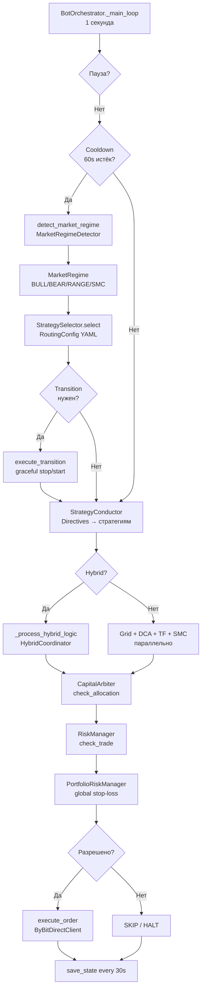
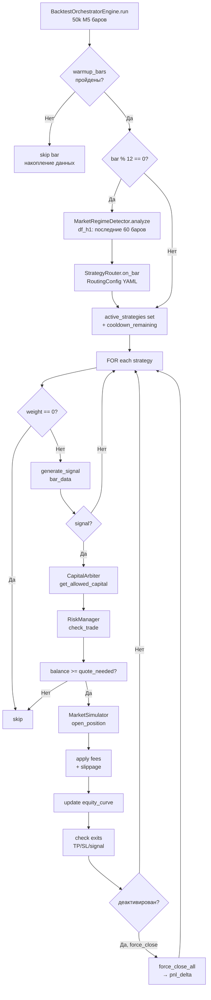
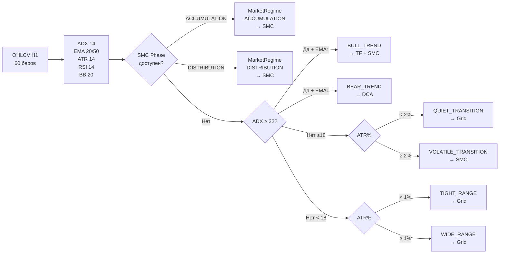

# TRADERAGENT — Комплексный анализ проекта

> Дата: 2026-03-11 · Версия: v2.1.0
> Кодовая база: ~120K+ LOC · 2197 тестов · Production: 5 ботов на Bybit Demo
> Автор: Tech Lead Audit

---

## 1. Текущее состояние

TRADERAGENT — платформа алгоритмической торговли (Python 3.12, asyncio, PostgreSQL, Redis). Работает на демо-аккаунте Bybit с 5 активными ботами (~$102k баланс). Поддерживает 4 стратегии через единый `BaseStrategy` интерфейс + адаптерный слой.

### Производственные боты

| Бот | Стратегия | Пара | Статус |
|-----|-----------|------|--------|
| demo_btc_hybrid | Grid + DCA (Hybrid) | BTC/USDT | ✅ Running |
| demo_eth_grid | Grid | ETH/USDT | ✅ Running |
| demo_sol_dca | DCA | SOL/USDT | ✅ Running |
| demo_btc_trend | TrendFollower | BTC/USDT | ✅ Running |
| demo_btc_smc | SMC (H1+M5, dry_run) | BTC/USDT | ✅ Running (dry_run) |

### Серверная инфраструктура

| Сервер | IP | Роль |
|--------|----|------|
| Production | 185.233.200.13 | Live-боты, Docker Compose |
| Testing | 158.160.215.57 | pytest (2197 тестов), backtest (.venv) |

### Ключевые вехи

| Веха | Статус |
|------|--------|
| BacktestOrchestratorEngine V3.0 | ✅ Phase 1: 43/43 пар, 50k баров |
| TradingCore (unified config) | ✅ Завершён — cooldown/fees/risk синхронизированы |
| P0-фиксы (force_close, trades, cooldown) | ✅ Реализованы |
| «Единый разумный трейдер» (Issues #356–#360) | ✅ MERGED |
| Унификация маршрутизации (Issues #368–#371) | ✅ MERGED |
| Phase 2 оптимизация | 🔴 Не запущена |

---

## 2. Сильные стороны архитектуры

### 2.1 Дизайн и паттерны

- **Единый `BaseStrategy` интерфейс** — `analyze_market()`, `generate_signal()`, `update_positions()`, `open_position()`, `close_position()`, `force_close_all()`. Замена стратегии не требует изменений оркестратора.
- **Адаптерный слой** (`*_adapter.py`) — полная изоляция внутренней логики. Один адаптер работает в live и backtest без изменений.
- **TradingCore** (`bot/core/trading_core/`) — единое ядро конфигурации (cooldown/fees/risk). `UnifiedBacktestEngine` транслирует TradingCore → OrchestratorBacktestConfig автоматически.
- **Единый `strategy_routing.yaml`** — RoutingConfig используется и в live (`StrategySelector`), и в backtest (`StrategyRouter`). Изменение правил маршрутизации применяется сразу в обоих местах.
- **6-режимный детектор рынка** (`market_regime.py`) — ADX/EMA гистерезис, SMC-фазы (ACCUMULATION/DISTRIBUTION), confluence score (5 компонентов).
- **Two-phase Cooldown** (Issue #360) — PRE_SWITCH → CONFIRMED стейт-машина предотвращает флапинг режимов при шуме.
- **SMCStructureAnalyzer** — кэширующий анализатор с 5-мин TTL, shared между всеми стратегиями.
- **PortfolioRiskManager** — глобальный stop-loss по символу с SharedCapitalPool.

### 2.2 Качество реализации стратегий

| Стратегия | Статус | Особенности |
|-----------|--------|-------------|
| **Grid** | ✅ Полная | force_close_all, VirtualPositionManager, recenter_cooldown |
| **DCA** | ✅ Полная | DCAStartupAnalyzer (catch-up), trailing stop, multi-step |
| **TrendFollower** | ✅ Полная | EMA/ATR/RSI, partial close, force_close_all ✅ (P0-фикс) |
| **SMC** | ✅ Полная | H1+M5 multi-TF, BOS/CHoCH, OB, FVG, force_close_all ✅ (P0-фикс) |
| **Hybrid (Grid+DCA)** | ✅ Полная | HybridCoordinator, ADX-based routing |

### 2.3 Тестирование и DevOps

- **2197 тестов** — 0 провалов (за исключением 26 pre-existing: web auth, flaky SMC market_structure)
- **CI/CD** — GitHub Actions: weekly optimization pipeline (.github/workflows/weekly_optimization.yml)
- **ProcessPoolExecutor** — параллельная оптимизация параметров в Phase 2 (8 workers)
- **TimescaleDB** — hypertable для OHLCV данных, WebSocket kline feed
- **Alembic** — версионированные миграции БД

### 2.4 Phase 1 — достоверные результаты (Grid + DCA)

| Пара | Grid Sharpe | DCA Sharpe | Total PnL (est.) |
|------|-------------|------------|------------------|
| LDOUSDT | 4.93 | 6.36 | +$122 |
| SANDUSDT | 5.13 | 5.75 | +$23 |
| BCHUSDT | 4.66 | 2.99 | +$58 |
| XEMUSDT | 4.61 | 3.02 | +$57 |
| BATUSDT | 3.64 | 3.16 | +$20 |
| ZILUSDT | 2.48 | 3.26 | +$45 |
| SOLUSDT | 2.05 | 3.13 | +$48 |
| LTCUSDT | 1.83 | 3.06 | +$69 |

*TF и SMC результаты Phase 1 недостоверны — исправлено в P0-фиксах.*

---

## 3. Слабые стороны и технический долг

### 3.1 КРИТИЧЕСКИЙ: Routing — additive (live) vs exclusive (backtest)

**Статус: 🔴 ОСТАЁТСЯ**

Несмотря на унификацию через `strategy_routing.yaml`, фундаментальное расхождение сохраняется:

```
Live Bot (_update_active_strategies):
  bull_trend → Grid + TrendFollower + SMC (3 стратегии одновременно)
  bear_trend → Grid + DCA + TrendFollower + SMC (все 4)

Backtest StrategyRouter (_compute_target_strategies):
  bull_trend → TrendFollower ТОЛЬКО
  bear_trend → DCA ТОЛЬКО
  volatile   → SMC ТОЛЬКО
  range      → Grid ТОЛЬКО
```

**Следствие**: Backtest Phase 1/2 не моделирует реальное поведение live-бота.
**Рекомендация**: Выбрать одну модель и применить в обоих местах (см. plan.md → C1).

---

### 3.2 ВАЖНЫЙ: SMC = 0 сделок в Phase 1 backtest

**Статус: 🔴 ТРЕБУЕТ ДИАГНОСТИКИ**

Phase 1 показал `trades=0` для SMC на большинстве пар. После P0-фиксов (force_close_all) ситуация должна улучшиться, но причины блокировки сигналов не выявлены:

- **Возможные причины:**
  - `max_positions=3` достигается быстро при малом balance ($1k)
  - `min_risk_reward=2.5` (default) слишком консервативен → мало сигналов
  - CapitalArbiter не даёт allocation для SMC в текущих режимах
  - SMC генерирует сигналы каждый бар (без throttle) → дубли → риск-чек падает

**Диагностика**: запустить smoke-test с SMC-only, `initial_balance=$10k`, детальными логами.

---

### 3.3 ВАЖНЫЙ: DCA DAILY LOSS LIMIT на 60% пар

**Статус: 🟡 ОЖИДАЕТ ФИКСА**

Phase 1: `DAILY LOSS LIMIT REACHED` на ~26 из 43 пар при `initial_balance=$1,000`.

```
$1,000 × 6% = $60/день
DCA открывает 4 позиции по $50 → $200 экспозиции
Первое же дневное движение → лимит достигнут
```

Live-бот: `$10,000 × 6% = $600` — тот же %, но DCA работает корректно.
**Фикс**: `initial_balance=$10,000` для Phase 2 backtest.

---

### 3.4 ВАЖНЫЙ: Cooldown — частичное расхождение

**Статус: 🟡 ЧАСТИЧНО ИСПРАВЛЕНО**

| Параметр | Live Bot | Backtest (после P0) |
|----------|----------|---------------------|
| cooldown_bars | 2 бара M5 (600s/300s) | 2 бара ✅ (исправлено) |
| regime_check | 60 сек (~0.2 бара) | 12 баров = 60 мин ⚠️ |

Regime check в backtest проверяется каждые 12 баров (1 час M5), тогда как в live — каждые 60 секунд. Backtest «медленнее» реагирует на смену режима, что делает его более консервативным.

---

### 3.5 УМЕРЕННЫЙ: strat_trades — сигналы вместо сделок

**Статус: ✅ ИСПРАВЛЕНО** (P0-фикс A2)

Было: `strat_trades += 1` при каждом сигнале (BATUSDT SMC: 4971 вместо ~50).
Теперь: `strat_trades += len(exits)` — только при закрытии позиций.

---

### 3.6 УМЕРЕННЫЙ: win_rate — бинарная метрика

**Статус: 🟡 ЧАСТИЧНО ИСПРАВЛЕНО**

Исходно: `100% если sum(pnl)>0, иначе 0%`.
В V3.0 реализован per-trade расчёт (SESSION_CONTEXT.md), но необходима проверка что он применяется везде.

---

### 3.7 УМЕРЕННЫЙ: HybridCoordinator не в backtest

**Статус: 🟠 ИЗВЕСТНАЯ ПРОБЛЕМА**

`demo_btc_hybrid` (live) использует `HybridCoordinator` (Grid↔DCA через ADX).
В бэктесте Grid и DCA работают как независимые стратегии. Результаты не сопоставимы.

---

### 3.8 УМЕРЕННЫЙ: Дублирование SMC реализаций

**Статус: 🟠 ТЕХНИЧЕСКИЙ ДОЛГ**

- `bot/strategies/smc_adapter.py` → `smartmoneyconcepts` (внешняя библиотека)
- `bot/core/smc/` → собственная реализация (BOS/CHoCH, swing detector O(n))

Параллельные реализации не синхронизированы. `bot/core/smc/` используется в `SMCStructureAnalyzer` для MarketRegimeDetector, но не в торговой логике SMCStrategyAdapter.

---

## 4. Конфликты: Live Bot vs Backtest V3.0

| Параметр | Live Bot | Backtest V3.0 | Критичность | Статус |
|---------|----------|---------------|-------------|--------|
| **Routing** | Additive (несколько стратегий) | Exclusive (одна) | 🔴 | Открыт |
| **force_close_all (TF/SMC)** | Нет (cancel_orders) | Есть | 🔴 | ✅ Исправлен |
| **Regime check interval** | 60s (real-time) | 12 баров (1 час) | 🟡 | Открыт |
| **Cooldown** | 600s = 2 бара M5 | 2 бара ✅ | 🟡 | ✅ Исправлен |
| **DCA daily loss** | $600 при $10k | $60 при $1k | 🟡 | Ожидает $10k balance |
| **strat_trades** | N/A | Закрытые сделки ✅ | 🟡 | ✅ Исправлен |
| **win_rate** | N/A | Per-trade ✅ | 🟡 | ✅ Исправлен |
| **SMC min_rr** | 2.0 (YAML) | 2.5 (default) | 🟠 | Открыт |
| **SMC throttling** | Нет | Нет | 🟠 | Открыт |
| **HybridCoordinator** | Активен | Не реализован | 🟠 | Открыт |
| **Fees** | 0.02%/0.055% | 0.02%/0.055% ✅ | ✅ | Синхронизировано |
| **max_daily_loss_pct** | 5% | 5% ✅ | ✅ | Синхронизировано |
| **strategy_routing.yaml** | Используется | Используется ✅ | ✅ | Синхронизировано |

---

## 5. Анализ параметров стратегий

### 5.1 Унификация — текущий статус

| Параметр | Источник истины | Статус |
|---------|-----------------|--------|
| `initial_balance` | YAML → backtest | ⚠️ Phase 1: $1k (мало), Phase 2: нужно $10k |
| `max_daily_loss_pct` | TradingCore (5%) | ✅ |
| `maker/taker_fee` | TradingCore | ✅ |
| `cooldown_bars` | TradingCore → /300s | ✅ |
| `regime_check_every_n` | 12 баров (фиксировано) | ⚠️ не из TradingCore |
| `max_position_pct` | YAML | ✅ |
| `grid_params` | backtest_phase1.yaml | ✅ |
| `dca_params` | backtest_phase1.yaml | ✅ |
| `tf_params` | backtest_phase1.yaml | ✅ |
| `smc.min_risk_reward` | YAML: 2.0, default: 2.5 | ❌ расхождение |
| `routing_mode` | strategy_routing.yaml | ❌ additive vs exclusive |
| `HybridCoordinator` | Только live | ❌ нет в backtest |

### 5.2 Влияние параметров на стратегии

**Grid**: `profit_per_grid` — определяет чувствительность к волатильности. При низкой vol (BTC): ≥1.2%, при высокой (LDO, BAT): ≥1.6%. `num_levels` — ширина сетки: чем шире, тем больший диапазон прикрывает, но медленнее ротация.

**DCA**: `trigger_pct` — компромисс между частотой входов и средней ценой. Слишком низкий (1-2%) → частые входы в нисходящем тренде → быстрый DAILY LOSS LIMIT. Рекомендуется 3-5%.

**TrendFollower**: `ema_fast/slow` — чем быстрее EMA, тем раньше вход, но больше ложных сигналов. `risk_per_trade_pct` — прямое влияние на P&L volatility. SMK рекомендует 1-2%.

**SMC**: `swing_length` — чем меньше, тем чаще сигналы. 10 = оптимум для H1 data. `min_risk_reward` — фильтр качества сигналов. 2.0 — разумный баланс между quantity и quality.

### 5.3 Рекомендации по параметрам (до Phase 2)

```
Grid (универсально):
  num_levels=8, profit_per_grid=0.012 (1.2%)

Grid (высокая волатильность: LDO, BAT):
  num_levels=6, profit_per_grid=0.016 (1.6%)

DCA (универсально):
  trigger_pct=0.04 (4%), max_steps=4, take_profit_pct=0.08 (8%)

DCA (BTC — низкая волатильность):
  trigger_pct=0.03, max_steps=3, take_profit_pct=0.06

TrendFollower (стандарт):
  ema_fast=20, ema_slow=50, risk_per_trade_pct=0.01

SMC (универсально):
  swing_length=10, min_risk_reward=2.0
```

---

## 6. Архитектурные блок-схемы

### 6.1 Живой бот — алгоритм главного цикла



### 6.2 Бэктест — алгоритм главного цикла



### 6.3 Детекция режима рынка



### 6.4 Сравнительная таблица: Live vs Backtest

| Компонент | Live Bot | Backtest V3.0 | Расхождение |
|-----------|----------|---------------|-------------|
| **Основной цикл** | asyncio, 1s tick | Синхронный, бар за баром | Разные частоты |
| **Источник данных** | WebSocket + REST API | CSV/DB OHLCV | Нет slippage в WS |
| **Режимная детекция** | Каждые 60s | Каждые 12 баров (1ч) | ⚠️ Backtest медленнее |
| **Маршрутизация** | Additive (несколько стратегий) | Exclusive (одна) | 🔴 Ключевое расхождение |
| **Cooldown** | 600s real-time | 2 бара ≈ 600s | ✅ Синхронизировано |
| **Fees** | 0.02%/0.055% | 0.02%/0.055% | ✅ Синхронизировано |
| **Slippage** | Exchange book | 0.03% модель | ⚠️ Упрощение |
| **Daily loss** | Reset UTC midnight | Reset каждый день | ✅ Одинаково |
| **Risk Manager** | Per-bot лимиты | Per-simulation лимиты | ✅ Идентичная логика |
| **Capital** | Реальные ордера | VirtualPositionManager | Нет рыночного impact |
| **Position tracking** | Order ID + exchange | Виртуальные позиции | Нет частичных заполнений |
| **HybridCoordinator** | Активен для hybrid-бота | Не реализован | 🟠 Пробел |

---

## 7. Выводы

### Что работает стабильно

1. **Grid стратегия** — полностью реализована и протестирована. Phase 1: SANDUSDT Sharpe 5.13.
2. **DCA стратегия** — работает, catch-up при старте. Phase 1: LDOUSDT Sharpe 6.36.
3. **Режимная детекция** — 6 режимов с SMC-приоритетом, ADX гистерезис предотвращает флапинг.
4. **Единый routing через YAML** — критическое улучшение, live и backtest используют одни правила.
5. **TradingCore** — параметры синхронизированы (fees, cooldown, risk).
6. **2197 тестов** — стабильное покрытие.

### Что требует работы

1. 🔴 **SMC = 0 сделок** — диагностика и фикс (`min_rr`, `max_positions`, CapitalArbiter).
2. 🔴 **Routing additive vs exclusive** — выбрать стратегию и синхронизировать.
3. 🔴 **Phase 2 оптимизация** — не запущена (требует $10k balance + P0-фиксы).
4. 🟡 **DCA daily loss scale** — нужен `initial_balance=$10k` для реалистичного теста.
5. 🟠 **HybridCoordinator в backtest** — для корректной оценки hybrid-бота.

---

*Связанные документы: [plan.md](plan.md) | [architecture_v2.md](architecture_v2.md) | [SESSION_CONTEXT.md](SESSION_CONTEXT.md)*
