# TRADERAGENT — Сравнение архитектур Live Bot и Backtest Engine

> Дата: 2026-03-09 · Версия: v2.2.0 · Коммит: `af9e61d`
>
> Предыдущая версия: [architecture.md](architecture.md) (v2.0.1)

---

## Содержание

1. [Общая архитектура Live Bot](#1-общая-архитектура-live-bot)
2. [Общая архитектура BacktestOrchestratorEngine V3.0](#2-общая-архитектура-backtestorchestratorengine-v30)
3. [Главное сравнение: тик Live vs бар Backtest](#3-главное-сравнение-тик-live-vs-бар-backtest)
4. [Стратегии — адаптерная архитектура](#4-стратегии--адаптерная-архитектура)
5. [Routing Logic: StrategySelector vs StrategyRouter](#5-routing-logic-strategyselector-vs-strategyrouter)
6. [Risk Management: 3 уровня vs 1 уровень](#6-risk-management-3-уровня-vs-1-уровень)
7. [Data Flow: real-time vs historical](#7-data-flow-real-time-vs-historical)
8. [SMC-ядро: общее между Live и Backtest](#8-smc-ядро-общее-между-live-и-backtest)
9. [Hybrid Mode: координация vs отсутствие](#9-hybrid-mode-координация-vs-отсутствие)
10. [MarketSimulator vs ByBitDirectClient](#10-marketsimulator-vs-bybitdirectclient)
11. [Health Monitoring и State Persistence](#11-health-monitoring-и-state-persistence)
12. [Конфигурация: TradingCore — единое ядро](#12-конфигурация-tradingcore--единое-ядро)
13. [Backtest Pipeline: 4 фазы](#13-backtest-pipeline-4-фазы)
14. [Результаты Backtest: структура данных](#14-результаты-backtest-структура-данных)
15. [Сводная сравнительная таблица](#15-сводная-сравнительная-таблица)
16. [Известные расхождения и план синхронизации](#16-известные-расхождения-и-план-синхронизации)

---

## 1. Общая архитектура Live Bot

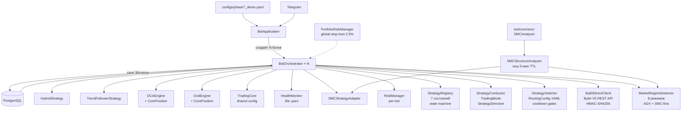

### Жизненный цикл тика (1 секунда)

```
 0ms  ── Проверка pause / daily reset
 1ms  ── Кеш баланса (REST ~100ms)
100ms ── _update_active_strategies (каждые 60с):
         ├── detect_market_regime (fetch 100 H1 + SMC overlay)
         ├── StrategySelector.select() → transition gates
         └── graceful_transition (cancel/close ~500ms)
600ms ── _process_hybrid_logic / grid / dca
700ms ── _process_trend_follower_logic (fetch 100 H1)
900ms ── _process_smc_logic:
         ├── Quick TP/SL (каждый тик, <1ms)
         └── Full analysis (каждые 5 мин: fetch 4 TF + analyze)
1750ms── _update_risk_manager
1800ms── save_state (каждые 30с)
1s    ── sleep
```

---

## 2. Общая архитектура BacktestOrchestratorEngine V3.0

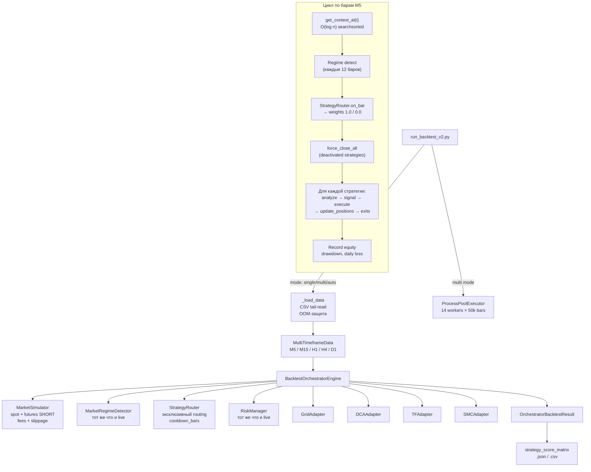

### Жизненный цикл бара M5 (300 секунд)

```
1. get_context_at(bar_index) — O(log n) × 5 TF
2. Regime detection (каждые 12 баров = 1 час):
   └── MarketRegimeDetector.analyze(df_h1) → RegimeAnalysis
3. StrategyRouter.on_bar(regime):
   ├── Cooldown check (2 бара = 600с)
   ├── Determine active_strategies (эксклюзивный маппинг)
   └── force_close_all(deactivated) → pnl_delta
4. Для каждой стратегии с weight > 0:
   a. analyze_market(df_d1..df_m5) — каждые analyze_every_n баров
   b. generate_signal(df_m5, balance) → signal?
   c. _handle_signal() → simulator.create_order (market)
   d. update_positions(current_price) → exits?
   e. _handle_exits() → PnL: (exit - entry) × amount
5. Record equity curve, per_strategy_pnl
6. RiskManager.check_daily_loss (reset каждые 288 баров = 1 день)
```

---

## 3. Главное сравнение: тик Live vs бар Backtest

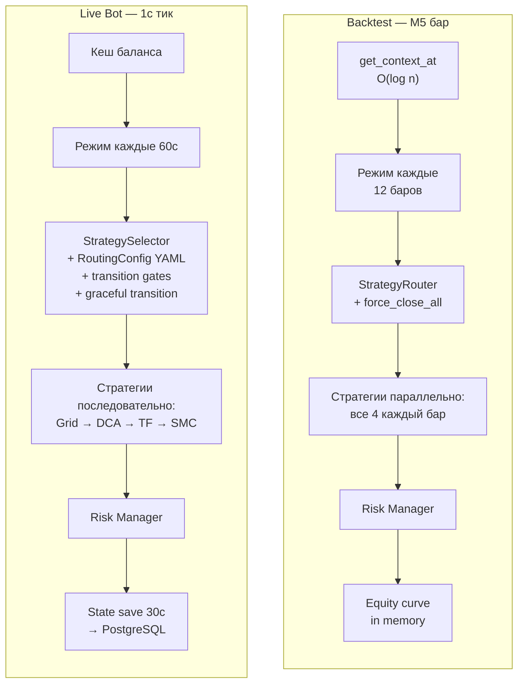

### Ключевые различия тика

| Аспект | Live Bot | Backtest V3.0 |
|--------|----------|---------------|
| **Частота** | 1 секунда | 1 бар M5 (300 секунд) |
| **Баланс** | REST API каждый тик | Симулятор in-memory |
| **Режим** | Каждые 60с (async) | Каждые 12 баров (1 час) |
| **Ордера** | Exchange API + verification | MarketSimulator instant fill |
| **Стратегии** | Последовательно (if active) | Все параллельно (weight filter) |
| **State** | PostgreSQL каждые 30с | In-memory (нет persistence) |
| **TP/SL проверка** | Каждый тик (1с) | Каждый бар (300с) |

---

## 4. Стратегии — адаптерная архитектура

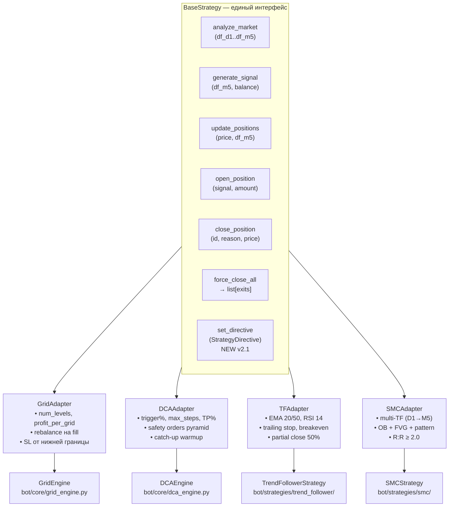

### Сравнение поведения адаптеров

| Аспект | Live Bot | Backtest |
|--------|----------|----------|
| **Grid: ордера** | Limit orders на бирже, отслеживание fills | Симуляция sweep OHLC |
| **Grid: rebalance** | REST API create_order после fill | Instant через simulator |
| **DCA: catch-up** | `_run_dca_catchup()` при старте бота | `_run_dca_warmup_catchup()` при warmup |
| **DCA: safety orders** | Market orders на бирже | Simulator market orders |
| **TF: данные** | Fetch 100 H1 candles (REST/HistoryManager) | get_context_at (in-memory) |
| **TF: trailing** | Каждый тик (1с) | Каждый бар (300с) |
| **SMC: throttle** | 5 мин wall-clock | Настраиваемый (1-60 баров) |
| **SMC: volume** | `require_volume_confirmation=True` | `=False` (нет реального объёма) |
| **force_close_all** | graceful_transition (cancel + market close) | Immediate close через simulator |
| **set_directive** | Через StrategyConductor (v2.1) | Не реализован |

---

## 5. Routing Logic: StrategySelector vs StrategyRouter

### Live Bot — StrategySelector (v2.1)

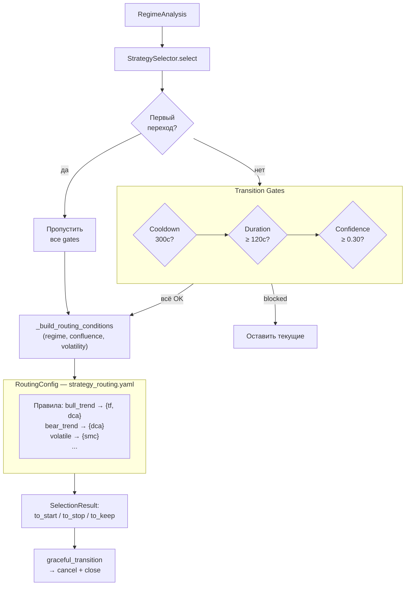

### Backtest — StrategyRouter (issue #371 — синхронизирован с live)

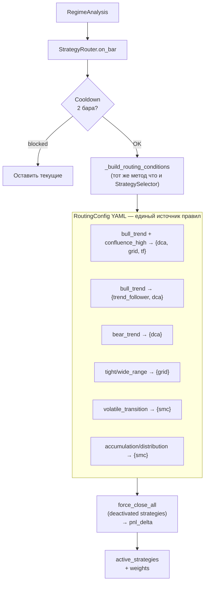

### Сравнение маппинга режим → стратегии (после issue #371)

| Режим | Live Bot (StrategySelector) | Backtest (StrategyRouter) | Статус |
|-------|---------------------------|--------------------------|--------|
| `TIGHT_RANGE` | Grid (1.0) | Grid (1.0) | ✅ Синхронизировано |
| `WIDE_RANGE` | Grid (1.0) | Grid (1.0) | ✅ Синхронизировано |
| `QUIET_TRANSITION` | Grid (0.7) | Grid (0.7) | ✅ Синхронизировано |
| `VOLATILE_TRANSITION` | SMC (1.0) | SMC (1.0) | ✅ Синхронизировано |
| `BULL_TREND` | TF (0.7) + DCA (0.3) | TF (0.7) + DCA (0.3) | ✅ Синхронизировано |
| `BULL_TREND` + conf ≥ 0.7 | DCA + Grid + TF (hybrid) | DCA + Grid + TF (hybrid) | ✅ Синхронизировано |
| `BEAR_TREND` | DCA (1.0) | DCA (1.0) | ✅ Синхронизировано |
| `ACCUMULATION` | SMC (1.0) | SMC (1.0) | ✅ Синхронизировано |
| `DISTRIBUTION` | SMC (1.0) | SMC (1.0) | ✅ Синхронизировано |
| `REDUCE_EXPOSURE` | {} (пустое) | {} (пустое) | ✅ Синхронизировано |
| `HOLD` | текущие стратегии | текущие стратегии | ✅ Синхронизировано |
| `NO_REGIME` / fallback | {grid, dca, tf, smc} | {grid, dca} bootstrap | 🟡 Bootstrap в backtest |

### Решение проблемы расхождения (issue #371)

Расхождение устранено: `StrategyRouter` теперь использует `RoutingConfig`
(тот же YAML-файл `configs/strategy_routing.yaml`), что и `StrategySelector`.
Оба компонента применяют идентичный метод `_build_routing_conditions()` для
формирования ключей поиска, поэтому для любого `RegimeAnalysis` live и backtest
возвращают **строго идентичные** наборы стратегий, веса и приоритеты.

Проверка синхронизации: `tests/integration/test_live_backtest_routing_sync.py`
(1000+ случайных сценариев + все основные режимы + граничные случаи).

---

## 6. Risk Management: 3 уровня vs 1 уровень

### Live Bot — 3 уровня

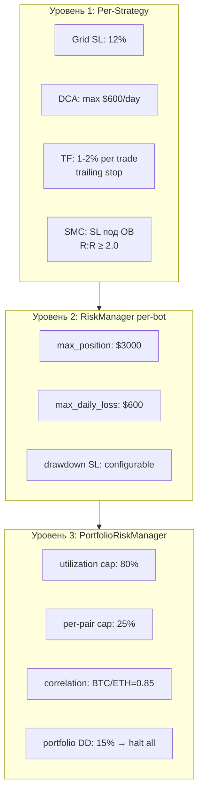

### Backtest — 1 уровень

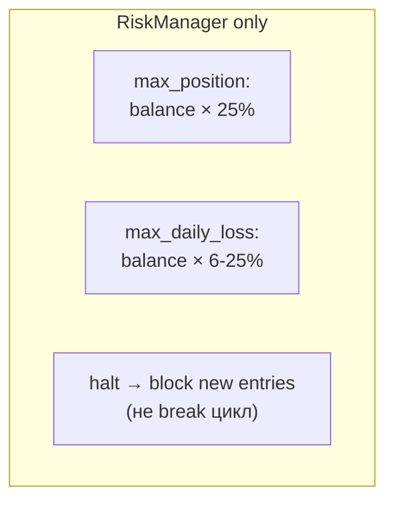

### Сравнение Risk Management

| Аспект | Live Bot | Backtest |
|--------|----------|---------|
| **Уровней** | 3 (strategy → bot → portfolio) | 1 (bot only) |
| **Position limit** | $3,000 абсолютный | 25% от баланса |
| **Daily loss** | $600 / 6% от баланса | 6-25% от баланса |
| **Daily reset** | UTC 00:00 | Каждые 288 баров (1 день M5) |
| **Portfolio halt** | Drawdown 15% → halt all bots | Нет |
| **Correlation** | BTC/ETH блок (0.85) | Нет |
| **Per-pair cap** | 25% от pool | Нет (одна пара) |
| **На halt** | emergency_stop (cancel all) | Блок новых входов (позиции живут) |
| **force_close при halt** | Да (cancel + market close) | Нет (только блок) |
| **PortfolioRiskManager** | Да (optional) | Нет |
| **Global stop-loss** | v2.1: `force_close_all(symbol)` | Нет |

---

## 7. Data Flow: real-time vs historical

### Live Bot

```mermaid
flowchart LR
    BYBIT[Bybit V5 API] --> |"fetch_ohlcv\nfetch_ticker\nfetch_balance"| ORCH[BotOrchestrator]
    WS[WebSocket\n(optional)] --> |"price stream"| ORCH
    HM_DB[HistoryManager\nTimescaleDB] --> |"cached OHLCV\nDB-first"| ORCH
    ORCH --> |"create/cancel\norders"| BYBIT
```

### Backtest

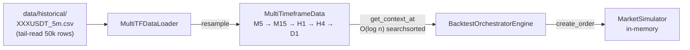

### Сравнение источников данных

| Аспект | Live Bot | Backtest |
|--------|----------|---------|
| **Источник** | Bybit REST + optional WebSocket | CSV файлы + resample |
| **Кеш** | HistoryManager (TimescaleDB) | In-memory DataFrame |
| **Таймфреймы** | Fetch каждый TF отдельно | Resample из M5 |
| **Обновление** | Real-time (1с) | Bar-by-bar (300с) |
| **Lookback** | 100-200 свечей per TF | 100 свечей (configurable) |
| **Доступ** | O(1) REST call ~200ms | O(log n) searchsorted ~0.01ms |
| **Объём** | Unlimited (real market) | 50k bars (~163 дня M5) |
| **Volume** | Реальный (Bybit OHLCV) | Исторический (может быть неточным) |

---

## 8. SMC-ядро: общее между Live и Backtest

SMC-ядро (`bot/core/smc/`) — **единственный общий компонент** без расхождений:

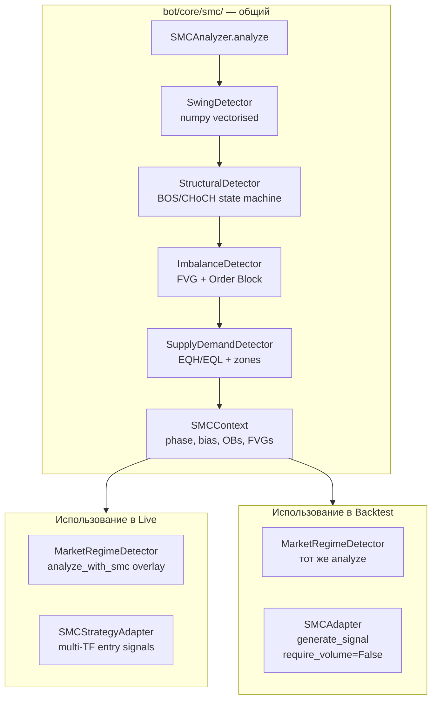

### Параметры SMC (идентичны)

| Параметр | Значение | Описание |
|----------|----------|----------|
| `swing_strength` | 5 | Баров в каждую сторону |
| `min_warmup_bars` | 200 | До warmup_complete |
| `min_impulse_atr` | 0.3 | Мин. импульс ×ATR |
| `min_fvg_atr` | 0.2 | Мин. FVG ×ATR |
| `tolerance_pct` | 0.002 | EQH/EQL кластеризация |

### Различия в использовании SMC

| Аспект | Live Bot | Backtest |
|--------|----------|---------|
| **Warmup** | Происходит в реальном времени (~17ч для 200 H1) | warmup_bars конфига (500-14400) |
| **SMC → Regime** | `analyze_with_smc()` overlay | Только `analyze()` (без SMC overlay) |
| **Volume filter** | `require_volume_confirmation=True` | `=False` |
| **Throttle** | 5 мин wall-clock | Настраиваемый (smc_analyze_every_n) |
| **Stale signal check** | 2% deviation от current_price | Нет (backtest = current bar price) |
| **ACCUMULATION/DISTRIBUTION** | Активирует SMC стратегию | ✅ Маппится через RoutingConfig → SMC |

---

## 9. Hybrid Mode: координация vs отсутствие

### Live Bot — HybridCoordinator

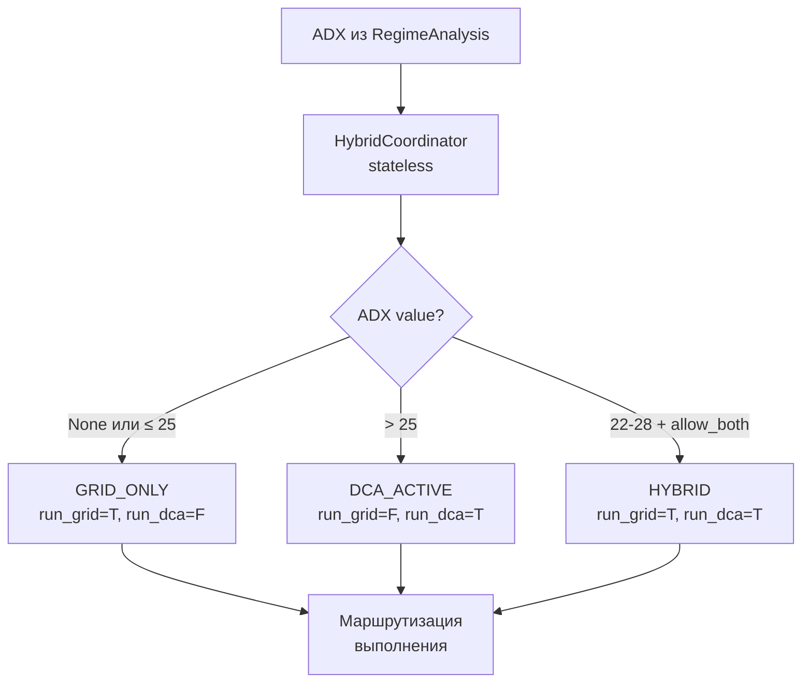

### Backtest — Hybrid через RoutingConfig

```
В BacktestOrchestratorEngine нет объекта HybridCoordinator.
Однако Grid + DCA могут работать одновременно через RoutingConfig:
  bull_trend + confluence ≥ 0.7 → {dca:0.5, grid:0.3, tf:0.2}
Координация Grid↔DCA происходит через веса, а не через ADX-переключатель.
```

### Сравнение Hybrid

| Аспект | Live Bot | Backtest |
|--------|----------|---------|
| **Механизм** | HybridCoordinator (ADX-based) | RoutingConfig YAML (confluence-based) |
| **Grid + DCA одновременно** | Да (HYBRID mode, ADX 22-28) | Да (bull_trend + confluence ≥ 0.7) |
| **Capital split** | 60% Grid / 30% DCA | Через weights: grid 0.3 / dca 0.5 |
| **ADX transition** | 25 ± 3 tolerance | Нет (по confluence, не ADX) |
| **HybridStrategy** | Transition tracking | Нет (stateless per-bar) |

---

## 10. MarketSimulator vs ByBitDirectClient

### Сравнение исполнения

| Аспект | ByBitDirectClient (Live) | MarketSimulator (Backtest) |
|--------|-------------------------|---------------------------|
| **Протокол** | REST HTTPS + HMAC-SHA256 | In-memory Python |
| **Latency** | ~100-300ms per request | ~0.01ms |
| **Order types** | Market + Limit (GTC) | Market + Limit |
| **Market fill** | Actual exchange | `price × (1 ± slippage)` |
| **Limit fill** | Exchange matching engine | OHLC sweep per bar |
| **Partial fills** | Возможны | Нет (всё или ничего) |
| **Slippage** | Реальный (market micro) | Фиксированный 0.03% |
| **Maker fee** | 0.02% (Bybit VIP0) | 0.02% (configurable) |
| **Taker fee** | 0.055% (Bybit VIP0) | 0.055% (configurable) |
| **SHORT** | Bybit linear futures | Margin simulation |
| **Balance** | Real exchange wallet | SimulatedBalance (base + quote) |
| **Portfolio value** | `fetch_balance()` | `base×price + quote + short_unrealized` |
| **Precision** | qtyStep/tickSize per symbol | Нет (Decimal arbitrary) |
| **Rate limits** | 120 req/s (Bybit) | Нет |
| **Retry** | 3 attempts, exp backoff | Нет (instant) |
| **Status normalization** | Filled→closed, New→open | Нет нормализации |
| **contractType filter** | Skip non-LinearPerpetual | N/A |

---

## 11. Health Monitoring и State Persistence

### Компоненты только в Live Bot

| Компонент | Файл | Назначение | В Backtest? |
|-----------|------|------------|-------------|
| **HealthMonitor** | `health_monitor.py` | 30с цикл: error count, signal timeout, trade timeout, авторестарт | **Нет** |
| **StrategyRegistry** | `strategy_registry.py` | State machine (7 состояний), metrics tracking | **Нет** |
| **State Persistence** | `state_persistence.py` | Save/load в PostgreSQL каждые 30с | **Нет** |
| **EventBus** | `events.py` | 35+ типов событий → Redis → Telegram | **Нет** |
| **PortfolioRiskManager** | `portfolio_risk_manager.py` | Кросс-пар утилизация, корреляция, halt | **Нет** |
| **HistoryManager** | `history_manager.py` | TimescaleDB OHLCV cache, backfill | **Нет** (CSV) |
| **StrategyConductor** | `strategy_conductor.py` | Иерархическое управление, директивы | **Нет** |
| **SMCStructureAnalyzer** | `structure_analyzer.py` | Кеширующий SMC сервис | **Нет** |
| **CorePosition** | `core_position.py` | Единая позиция DCA+Grid | **Нет** |

### HealthMonitor пороги (Live only)

| Порог | Значение | Результат |
|-------|----------|-----------|
| `max_error_count` | 10 | → UNHEALTHY |
| `max_consecutive_errors` | 3 | → CRITICAL |
| `signal_timeout_seconds` | 300 | → DEGRADED |
| `trade_timeout_seconds` | 3600 | → DEGRADED |
| `auto_restart` | true | ERROR → reset → start |
| `max_restart_attempts` | 3 | Макс. перезапусков |

---

## 12. Конфигурация: TradingCore — единое ядро

`TradingCoreConfig` — **единственный shared config** между Live и Backtest:

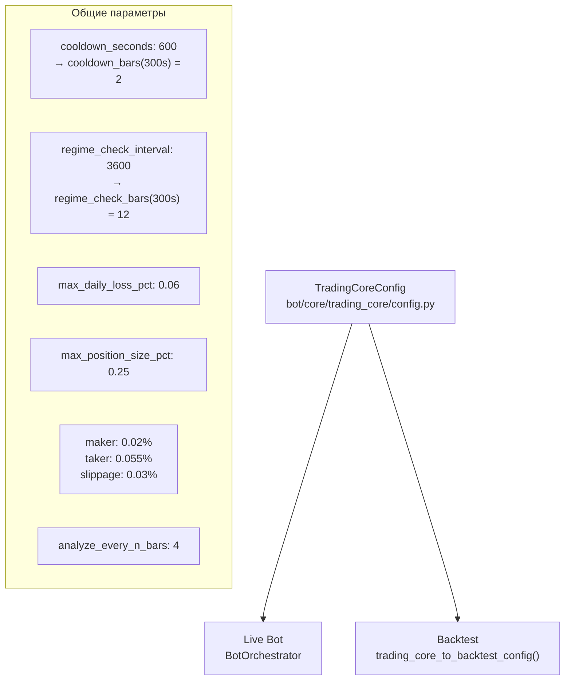

### Сравнение конфигурации

| Параметр | TradingCoreConfig | Live Bot | Backtest |
|----------|-------------------|----------|----------|
| `cooldown_seconds` | 600 | 600с wall-clock | 2 бара M5 |
| `regime_check_interval` | 3600 | 60с (override!) | 12 баров M5 |
| `max_daily_loss_pct` | 0.06 | $600 при $10k | $60 при $1k ⚠️ |
| `maker_fee` | 0.0002 | Реальные Bybit | Симулятор |
| `taker_fee` | 0.00055 | Реальные Bybit | Симулятор |
| `slippage` | 0.0003 | Реальный рынок | Фиксированный |
| `analyze_every_n_bars` | 4 | Per-strategy throttle | 1 (каждый бар) |

> ⚠️ **Расхождение daily loss**: при $1k балансе backtest лимит = $60, что вызывает ложные стопы.
> Live bot с $10k: лимит = $600 — адекватнее.

---

## 13. Backtest Pipeline: 4 фазы

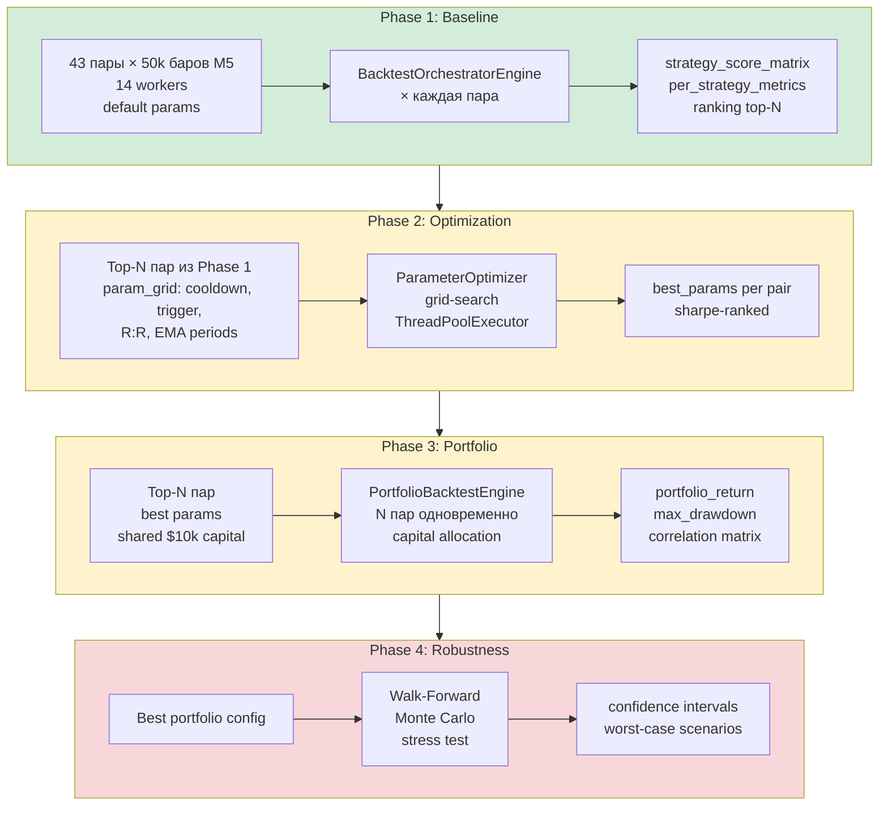

### Статус фаз

| Фаза | Статус | Результат |
|------|--------|-----------|
| Phase 1 | ✅ Complete (43/43 пар) | 5/37 profitable, SMC=0 trades |
| Phase 2 | ⏳ Framework ready | Param grid defined |
| Phase 3 | ⏳ Framework ready | PortfolioBacktestEngine |
| Phase 4 | ⏳ Framework ready | Walk-Forward + Monte Carlo |

---

## 14. Результаты Backtest: структура данных

### OrchestratorBacktestResult

```python
@dataclass
class OrchestratorBacktestResult(BacktestResult):
    # Base (BacktestResult):
    strategy_name: str              # "orchestrator"
    symbol: str                     # "BTC/USDT"
    initial_balance: Decimal        # $1,000
    final_balance: Decimal
    total_return_pct: Decimal
    max_drawdown_pct: Decimal
    total_trades: int
    win_rate: Decimal               # ⚠️ упрощённый (100% если sum(pnl)>0)
    sharpe_ratio: Decimal | None
    profit_factor: Decimal | None
    trade_history: list[dict]
    equity_curve: list[dict]

    # V2.0 extensions:
    strategy_switches: list[dict]   # [{bar, from, to, regime}]
    per_strategy_pnl: dict          # {grid: +50, dca: -10, tf: +23, smc: 0}
    regime_routing_stats: dict      # {bull_trend: 100, tight_range: 250}
    cooldown_events: int            # раз cooldown заблокировал switch

    # V3.0 extensions:
    per_strategy_metrics: dict[str, StrategyPeriodMetrics]
```

### StrategyPeriodMetrics

```python
@dataclass
class StrategyPeriodMetrics:
    bars_active: int        # баров когда weight=1.0
    trades: int             # закрытых round-trips
    realized_pnl: float     # (exit - entry) × amount
    sharpe: float | None    # annualized, только активные периоды
    max_drawdown_pct: float # peak-to-trough при активности
    win_rate: float         # ⚠️ 100% если pnl>0, 0% если pnl≤0
```

### Phase 1 Score Matrix

```
strategy_score_matrix.csv:
symbol, grid_pnl, grid_trades, grid_sharpe, dca_pnl, dca_trades, ..., smc_pnl, smc_trades
BTCUSDT, +50, 12, 0.8, -200, 4, ..., 0, 0
ETHUSDT, +30, 8, 0.5, -150, 3, ..., 0, 0
...
```

---

## 15. Сводная сравнительная таблица

| Аспект | Live Bot | Backtest V3.0 | Статус синхронизации |
|--------|----------|---------------|---------------------|
| **Тик** | 1с async | M5 бар (300с) | ✅ Ожидаемо |
| **Routing** | StrategySelector (RoutingConfig) | StrategyRouter (RoutingConfig) | ✅ **Синхронизировано** (#371) |
| **Cooldown** | 300с wall-clock | 2 бара M5 (600с) | ✅ Согласовано |
| **Regime check** | 60с (override) | 12 баров (1ч) | 🟡 Разная частота |
| **Transition** | graceful (cancel+close) | force_close_all | ✅ Функционально |
| **ACCUMULATION** | → SMC (StrategySelector) | → SMC (RoutingConfig) | ✅ **Синхронизировано** (#371) |
| **Hybrid** | HybridCoordinator (ADX) | RoutingConfig (confluence) | 🟡 Разный механизм |
| **SMC volume** | require=True | require=False | ✅ Ожидаемо |
| **SMC throttle** | 5 мин | Настраиваемый | ✅ Согласовано |
| **SMC stale check** | 2% deviation | Нет | ✅ Ожидаемо |
| **Fees** | 0.02%/0.055% (Bybit) | 0.02%/0.055% (TradingCore) | ✅ Согласовано |
| **Slippage** | Real market | 0.03% fixed | ✅ Приемлемо |
| **Position size** | $3000 absolute | 25% of balance | 🟡 Разные единицы |
| **Daily loss** | $600 / 6% | 6-25% | 🟡 Разные пропорции |
| **Portfolio risk** | 3 уровня | 1 уровень | 🔴 **Расхождение** |
| **Health monitor** | 30с цикл + авторестарт | Нет | ✅ Ожидаемо |
| **State persistence** | PostgreSQL 30с | In-memory | ✅ Ожидаемо |
| **DCA catch-up** | ✅ Реализован | ✅ warmup catch-up | ✅ Согласовано |
| **StrategyConductor** | ✅ v2.1 | Нет | 🟡 Новое (не критично) |
| **CorePosition** | ✅ v2.1 | Нет | 🟡 Новое (не критично) |
| **Two-phase cooldown** | ✅ v2.1 | Нет | 🟡 Новое (не критично) |
| **Config source** | phase7_demo.yaml | backtest_phase1.yaml | ✅ TradingCore shared |
| **win_rate** | N/A (live) | ⚠️ sum(pnl)>0 → 100% | 🟡 Грубое приближение |

---

## 16. Известные расхождения и план синхронизации

### ✅ Устранённые расхождения (issue #371)

#### 1. Routing: unified via RoutingConfig ✅

**Ранее (до #371):** `StrategyRouter` использовал захардкоженный `_REGIME_TO_STRATEGIES`,
расходившийся с `StrategySelector`. Например, `BULL_TREND` давал только TF в backtest,
тогда как live активировал TF + DCA.

**Решение:** `StrategyRouter` теперь принимает `RoutingConfig` и использует **тот же
YAML-файл** (`configs/strategy_routing.yaml`) и **тот же метод `_build_routing_conditions()`**,
что и `StrategySelector`. Это гарантирует полную идентичность routing в live и backtest.

**Доказательство:** `tests/integration/test_live_backtest_routing_sync.py` — 1000+
случайных сценариев, все основные режимы и граничные случаи.

#### 2. ACCUMULATION/DISTRIBUTION ✅

**Ранее:** StrategyRouter не имел маппинга для этих режимов.
**Решение:** Через YAML-правила `accumulation → {smc}`, `distribution → {smc}` (уже в
`configs/strategy_routing.yaml`).

### 🟡 Hybrid: разные механизмы координации

#### 3. Hybrid mode — ADX (live) vs confluence (backtest)

**Live:** Grid + DCA координируются через HybridCoordinator (ADX 25 ± 3)
**Backtest:** Grid + DCA координируются через RoutingConfig (`bull_trend + confluence ≥ 0.7`)

**Влияние:** Оба поддерживают одновременную работу Grid+DCA, но триггеры разные.
**Fix (optional):** Унифицировать триггер (ADX или confluence, не оба).

### 🟡 Некритические расхождения

| Расхождение | Влияние | Приоритет |
|-------------|---------|-----------|
| Regime check 60с vs 1ч | Backtest менее реактивен | P2 |
| Daily loss пропорции | Ложные стопы при $1k | P1 |
| win_rate приближение | Неточная метрика | P2 |
| Position size единицы | Разное поведение на границах | P2 |
| v2.1 компоненты (Conductor, CorePosition, Two-phase) | Не тестируются | P2 |

### Приоритеты синхронизации

```
✅ DONE: StrategySelector в backtest (routing parity) — #371
✅ DONE: ACCUMULATION/DISTRIBUTION маппинг — #371
✅ DONE: Hybrid Grid+DCA в backtest (через RoutingConfig) — #371
P1: Daily loss alignment ($1k → $10k или % нормализация)
P1: Унификация Hybrid-триггера (ADX vs confluence)
P2: v2.1 компоненты в backtest (StrategyConductor, CorePosition)
P2: win_rate: per-trade вместо sum>0
```

---

*Связанные документы: [bot_architecture_v2.md](bot_architecture_v2.md) | [architecture.md](architecture.md) | [analysis.md](analysis.md) | [plan.md](plan.md)*
