# Архитектура живого бота — блок-схемы и алгоритмы

> Актуально на: 2026-03-07 · Версия: v2.0.0 · Коммит: `d10aff7`

---

## Содержание

1. [Обзор системы](#1-обзор-системы)
2. [Главный цикл](#2-главный-цикл)
3. [Определение режима рынка](#3-определение-режима-рынка)
4. [Маршрутизация стратегий](#4-маршрутизация-стратегий)
5. [Grid-стратегия](#5-grid-стратегия)
6. [DCA-стратегия](#6-dca-стратегия)
7. [TrendFollower-стратегия](#7-trendfollower-стратегия)
8. [SMC-стратегия](#8-smc-стратегия)
9. [Hybrid-режим (Grid↔DCA)](#9-hybrid-режим-griddca)
10. [Risk Management](#10-risk-management)
11. [Graceful Transition](#11-graceful-transition)

---

## 1. Обзор системы

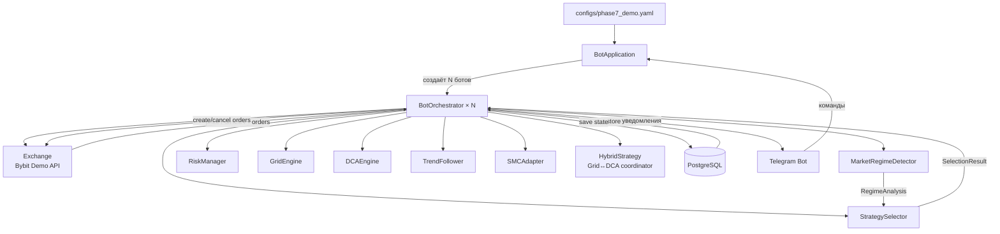

> **Комментарий:** ___

---

## 2. Главный цикл

Каждые **1 секунду** (`asyncio.sleep(1)`):

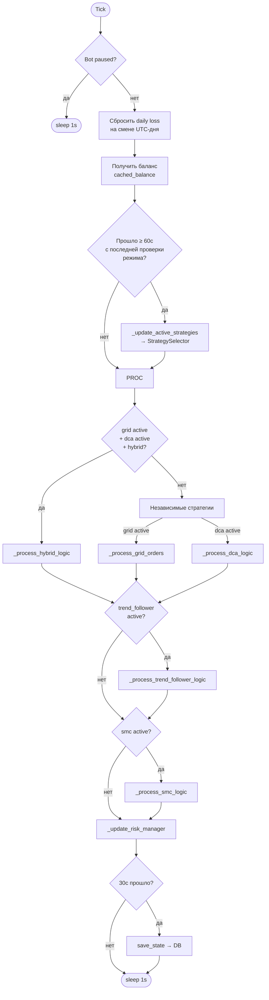

> **Комментарий:** ___

---

## 3. Определение режима рынка

Запускается каждые **60 секунд** (`regime_check_interval_seconds`).

### 3.1 Двухуровневая классификация (v3.0)

Режим определяется в два приоритетных уровня:

1. **Приоритет 1 — SMC-фаза** (`SMCStructureAnalyzer`, TTL-кэш 5 мин):
   Если `SMCContext.phase == ACCUMULATION` или `DISTRIBUTION` и `warmup_complete=True` → режим устанавливается немедленно, без проверки индикаторов.
   Дополнительно: **freeze** — пока SMC-структура активна, шум ADX/EMA не может сменить режим. Заморозка снимается только при явном CHoCH в противоположном направлении.

2. **Приоритет 2 — Индикаторы** (ADX/EMA/ATR с гистерезисом):
   Используется как fallback для всех остальных режимов.
   ATR уточняет волатильность в любом режиме.

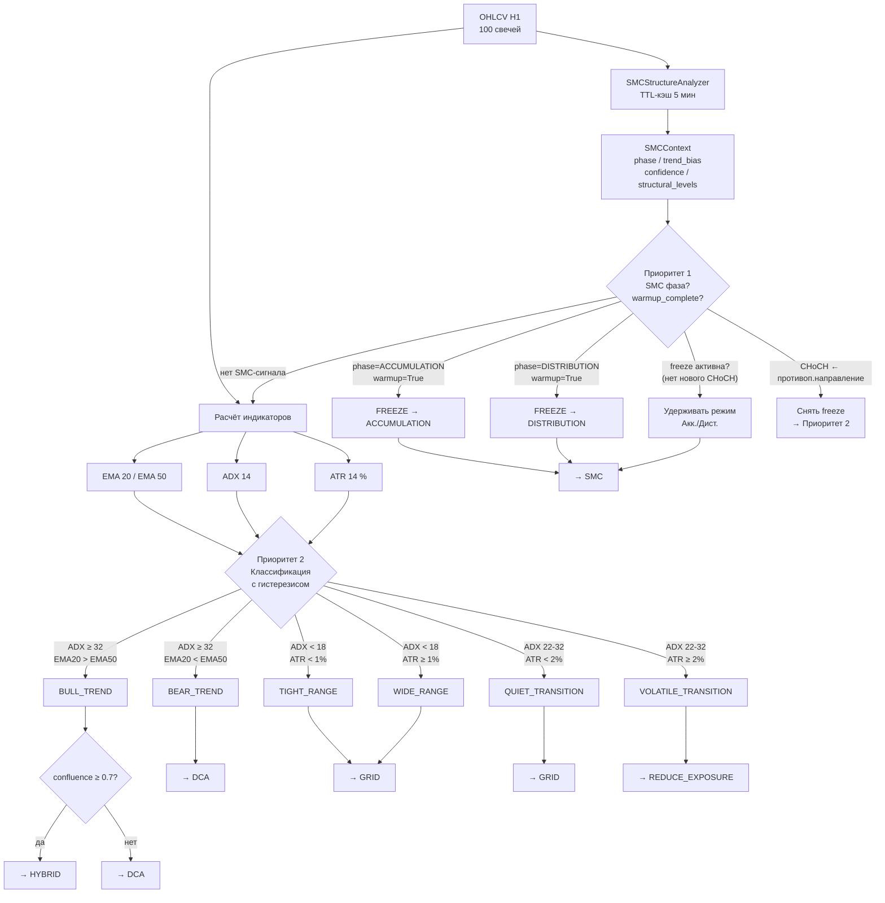

### Параметры детектора

| Параметр | Значение | Описание | Комментарий |
|----------|----------|----------|-------------|
| `ema_fast` | 20 | Быстрая EMA | |
| `ema_slow` | 50 | Медленная EMA | |
| `adx_period` | 14 | Период ADX | |
| `atr_period` | 14 | Период ATR | |
| `rsi_period` | 14 | Период RSI | |
| `bb_period` | 20 | Период Bollinger Bands | |
| `adx_enter_trending` | 32.0 | Порог входа в тренд | |
| `adx_exit_trending` | 25.0 | Порог выхода из тренда (гистерезис) | |
| `adx_enter_ranging` | 18.0 | Порог входа в диапазон | |
| `adx_exit_ranging` | 22.0 | Порог выхода из диапазона (гистерезис) | |
| `atr_wide_threshold` | 1.0% | Граница tight/wide range | |
| `atr_volatile_threshold` | 2.0% | Граница quiet/volatile transition | |
| `confluence_threshold` | 0.7 | Порог для HYBRID-режима | |

### SMCStructureAnalyzer параметры

| Параметр | Значение | Описание |
|----------|----------|----------|
| `ttl_seconds` | 300 (5 мин) | TTL кэша SMCContext на символ |
| `swing_strength` | 5 | Баров для подтверждения свинга |
| `min_warmup_bars` | 200 | Минимум свечей для валидного контекста |

> **Комментарий:** Версия v3.0. `SMCStructureAnalyzer` — независимый от SMC-стратегии сервис, работает всегда. `SMCContext.confidence` и `structural_levels` добавлены для downstream-компонентов.

---

## 4. Маршрутизация стратегий

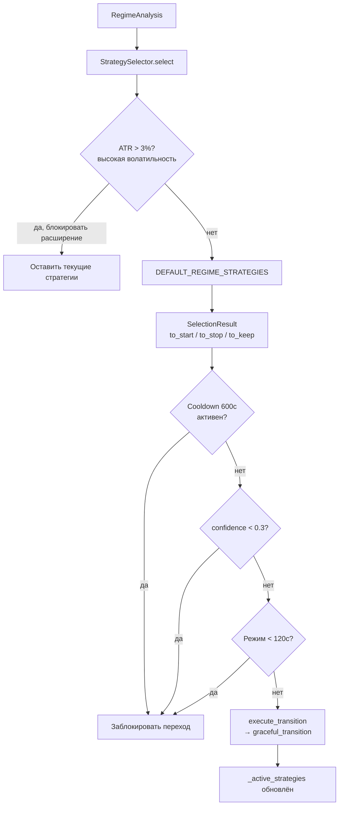

### Маппинг режим → стратегии

| Режим | Стратегии | Веса | Комментарий |
|-------|-----------|------|-------------|
| `TIGHT_RANGE` | Grid | 1.0 | |
| `WIDE_RANGE` | Grid | 1.0 | |
| `QUIET_TRANSITION` | Grid | 0.7 | |
| `VOLATILE_TRANSITION` | SMC | 1.0 | |
| `BULL_TREND` | TrendFollower + DCA | 0.7 + 0.3 | |
| `BULL_TREND` + confluence ≥ 0.7 | DCA + Grid + TF | 0.5 + 0.3 + 0.2 | HYBRID |
| `BEAR_TREND` | DCA | 1.0 | |
| `ACCUMULATION` | SMC | 1.0 | |
| `DISTRIBUTION` | SMC | 1.0 | |
| `REDUCE_EXPOSURE` | — | — | все выключены |

### Параметры переключения

| Параметр | Значение | Описание | Комментарий |
|----------|----------|----------|-------------|
| `strategy_switch_cooldown_seconds` | 600 с | Минимум между переключениями | |
| `regime_check_interval_seconds` | 60 с | Частота проверки режима | |
| `_MIN_REGIME_CONFIDENCE` | 0.3 | Мин. уверенность для переключения | |
| `_MIN_REGIME_DURATION_SECONDS` | 120 с | Мин. возраст режима | |
| `_MAX_VOLATILITY_ATR_PCT` | 3.0% | Блок расширения при волатильности | |

> **Комментарий:** ___

---

## 5. Grid-стратегия

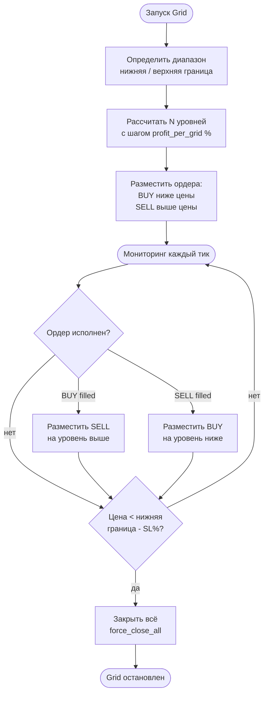

### Параметры Grid (BTC demo)

| Параметр | Значение | Описание | Комментарий |
|----------|----------|----------|-------------|
| `grid_levels` | 6 | Количество уровней сетки | |
| `amount_per_grid` | $150 | Объём на каждый уровень | |
| `profit_per_grid` | 1.2% | Шаг между уровнями | |
| `stop_loss_percentage` | 12% | SL от нижней границы | |
| `min_order_size` | $150 | Минимальный размер ордера | |
| `capital_allocation` | 60% | Доля капитала (Hybrid-режим) | |

> **Комментарий:** ___

---

## 6. DCA-стратегия

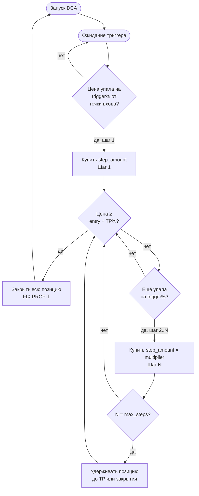

### Параметры DCA (BTC demo)

| Параметр | Значение | Описание | Комментарий |
|----------|----------|----------|-------------|
| `trigger_percentage` | 4% | Падение для первого входа | |
| `max_steps` | 4 | Максимум шагов усреднения | |
| `take_profit_percentage` | 8% | TP от средней цены входа | |
| `step_multiplier` | 1.0 | Множитель объёма на каждый шаг | |
| `capital_allocation` | 30% | Доля капитала (Hybrid-режим) | |
| `catch_up_enabled` | false | Умный старт при запуске бота | |
| `max_daily_loss` | $600 | Дневной лимит убытка | |

> **Комментарий:** ___

---

## 7. TrendFollower-стратегия

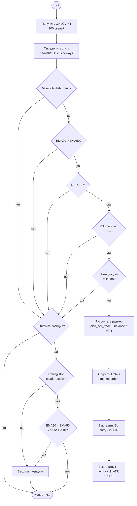

### Параметры TrendFollower (BTC demo)

| Параметр | Значение | Описание | Комментарий |
|----------|----------|----------|-------------|
| `ema_fast_period` | 20 | Период быстрой EMA | |
| `ema_slow_period` | 50 | Период медленной EMA | |
| `atr_period` | 14 | Период ATR для SL/TP | |
| `rsi_period` | 14 | Период RSI | |
| `risk_per_trade_pct` | 1% | Риск на сделку от баланса | |
| `max_positions` | 2 | Макс. одновременных позиций | |
| `trailing_stop_atr_mult` | 2.0× | Множитель ATR для трейлинг-стопа | |
| `take_profit_atr_mult` | 3.0× | Множитель ATR для тейк-профита | |
| `active_regimes` | bull_trend | Только в бычьем тренде | |

> **Комментарий:** ___

---

## 8. SMC-стратегия

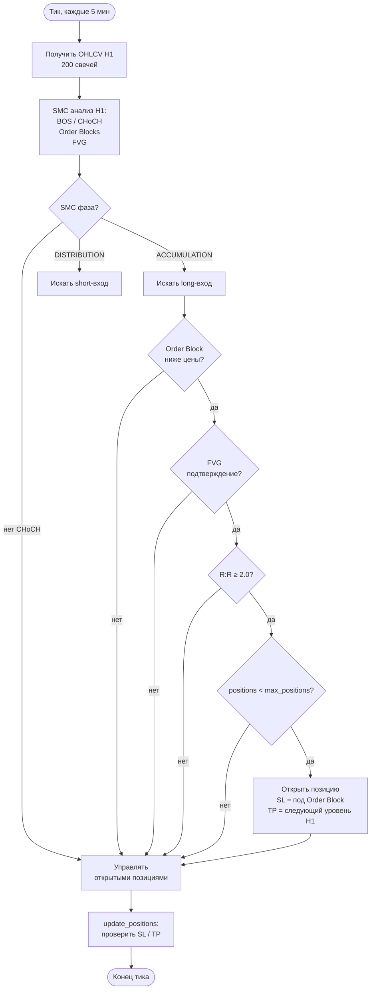

### Параметры SMC (BTC demo, H1 режим)

| Параметр | Значение | Описание | Комментарий |
|----------|----------|----------|-------------|
| `swing_length` | 10 | Длина свинга для структуры H1 | |
| `min_risk_reward` | 2.0 | Минимальный R:R для входа | |
| `max_positions` | 2 | Макс. одновременных позиций | |
| `risk_per_trade_pct` | 1% | Риск на сделку | |
| `require_volume_confirmation` | false | Подтверждение объёмом | |
| `active_regimes` | accumulation, distribution | Режимы для входа | |

### Параметры SMC (M5 режим, если включён)

| Параметр | Значение | Описание | Комментарий |
|----------|----------|----------|-------------|
| `swing_length_h1` | 10 | Свинг для H1-структуры | |
| `swing_length_m5` | 20 | Свинг для M5-входа | |
| `h1_limit` | 200 | Свечей H1 для анализа структуры | |
| `m5_limit` | 1000 | Свечей M5 (~3.5 дня) | |
| `min_risk_reward` | 2.0 | Мин. R:R для M5-входа | |
| `max_positions` | 2 | Макс. позиций в M5-режиме | |

> **Комментарий:** ___

---

## 9. Hybrid-режим (Grid↔DCA)

Активируется когда **Grid и DCA работают одновременно**. Координатором является `HybridStrategy`.

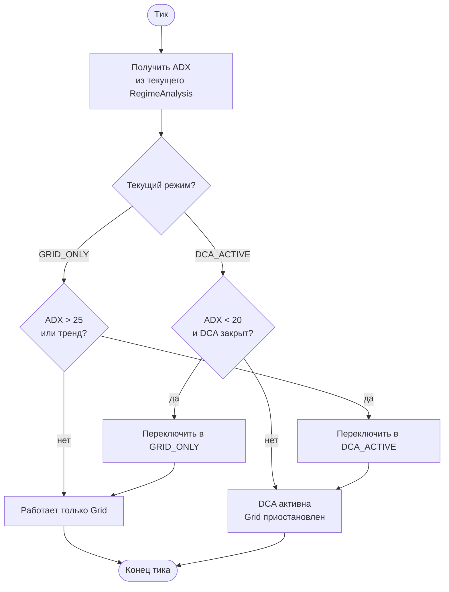

### Параметры Hybrid

| Параметр | Значение | Описание | Комментарий |
|----------|----------|----------|-------------|
| `grid_capital_pct` | 60% | Доля капитала для Grid | |
| `dca_capital_pct` | 30% | Доля капитала для DCA | |
| `initial_mode` | GRID_ONLY | Стартовый режим | |

> **Комментарий:** ___

---

## 10. Risk Management

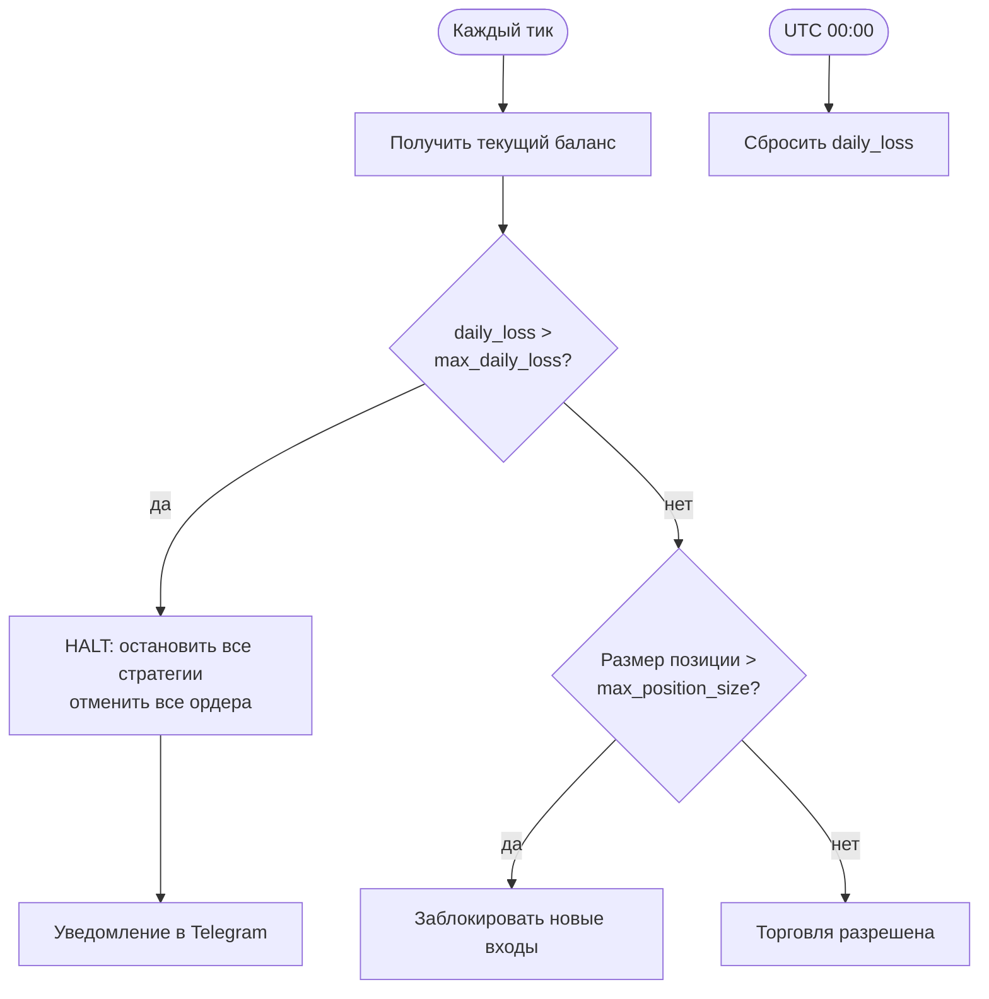

### Параметры риска (BTC demo)

| Параметр | Значение | Описание | Комментарий |
|----------|----------|----------|-------------|
| `max_daily_loss` | $600 | Макс. дневной убыток | |
| `max_position_size` | $3,000 | Макс. размер позиции | |
| `max_daily_loss_pct` | 6% | Дневной лимит в % от баланса | |
| `risk_per_trade_pct` | 1% | Риск на одну сделку | |
| `daily_reset` | UTC 00:00 | Сброс счётчика убытка | |

> **Комментарий:** ___

---

## 11. Graceful Transition

Срабатывает когда StrategySelector решает **деактивировать** стратегию.

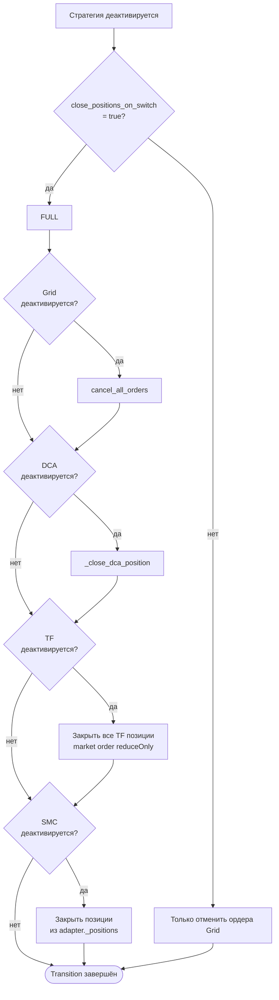

### Параметры перехода

| Параметр | Значение | Описание | Комментарий |
|----------|----------|----------|-------------|
| `close_positions_on_switch` | false | Закрывать позиции при деактивации | |
| `strategy_switch_cooldown_seconds` | 600 с | Cooldown между переключениями | |

> **Комментарий:** ___

---

## Сводная таблица: режим → стратегия → ожидаемое поведение

| Режим рынка | ADX | ATR | Активные стратегии | Ожидаемое действие | Комментарий |
|-------------|-----|-----|-------------------|-------------------|-------------|
| TIGHT_RANGE | < 18 | < 1% | Grid | Сетка в узком диапазоне | |
| WIDE_RANGE | < 18 | ≥ 1% | Grid | Сетка с широкими уровнями | |
| QUIET_TRANSITION | 22–32 | < 2% | Grid | Сетка в переходной зоне | |
| VOLATILE_TRANSITION | 22–32 | ≥ 2% | SMC | Ловля разворотов | |
| BULL_TREND (low conf.) | > 32 | — | TF + DCA | Тренд + усреднение | |
| BULL_TREND (high conf.) | > 32 | — | TF + DCA + Grid | Гибридный режим | |
| BEAR_TREND | > 32 | — | DCA | Усреднение при падении | |
| ACCUMULATION | любой | — | SMC | CHoCH вверх → long | |
| DISTRIBUTION | любой | — | SMC | CHoCH вниз → short | |

> **Общий комментарий:** ___

---

*Связанные документы: [analysis.md](analysis.md) | [plan.md](plan.md) | [SESSION_CONTEXT.md](SESSION_CONTEXT.md)*
