# Архитектура живого бота — блок-схемы и алгоритмы (v2)

> Актуально на: 2026-03-08 · Версия: v2.1.0 · Коммит: `f3b2a78`
>
> Предыдущая версия: [bot_architecture.md](bot_architecture.md) (v2.0.0)

---

## Содержание

1. [Обзор системы](#1-обзор-системы)
2. [Жизненный цикл бота](#2-жизненный-цикл-бота)
3. [Главный цикл](#3-главный-цикл)
4. [Определение режима рынка](#4-определение-режима-рынка)
5. [SMC-ядро (core/smc)](#5-smc-ядро-coresmc)
6. [Маршрутизация стратегий](#6-маршрутизация-стратегий)
7. [Grid-стратегия](#7-grid-стратегия)
8. [DCA-стратегия](#8-dca-стратегия)
9. [TrendFollower-стратегия](#9-trendfollower-стратегия)
10. [SMC-стратегия](#10-smc-стратегия)
11. [Hybrid-режим (Grid↔DCA)](#11-hybrid-режим-griddca)
12. [Risk Management (3 уровня)](#12-risk-management-3-уровня)
13. [Graceful Transition](#13-graceful-transition)
14. [Health Monitor и автовосстановление](#14-health-monitor-и-автовосстановление)
15. [Система событий](#15-система-событий)
16. [Exchange Client (Bybit V5)](#16-exchange-client-bybit-v5)
17. [Сводная таблица](#17-сводная-таблица)

---

## 1. Обзор системы

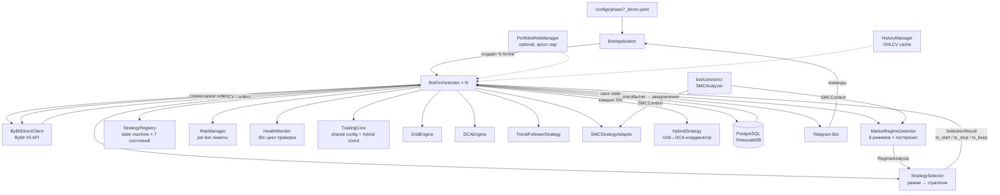

### Ключевые компоненты

| Компонент | Файл | Ответственность |
|-----------|------|-----------------|
| `BotOrchestrator` | `bot/orchestrator/bot_orchestrator.py` (~2365 строк) | Главный координатор: цикл, стратегии, ордера |
| `MarketRegimeDetector` | `bot/orchestrator/market_regime.py` | 8-режимный классификатор с ADX-гистерезисом |
| `StrategySelector` | `bot/orchestrator/strategy_selector.py` | Маппинг режим → стратегии, cooldown, transition gates |
| `StrategyRegistry` | `bot/orchestrator/strategy_registry.py` | State machine жизненного цикла стратегий |
| `HealthMonitor` | `bot/orchestrator/health_monitor.py` | Мониторинг здоровья, авторестарт |
| `SMCAnalyzer` | `bot/core/smc/analyzer.py` | Структурный анализ: свинги, BOS/CHoCH, OB, FVG |
| `RiskManager` | `bot/core/risk_manager.py` | Per-bot лимиты: позиция, daily loss, SL |
| `PortfolioRiskManager` | `bot/core/portfolio_risk_manager.py` | Кросс-пар: корреляция, utilization cap, портфельный halt |
| `TradingCore` | `bot/core/trading_core/core.py` | Общий конфиг live↔backtest, HybridCoordinator |
| `ByBitDirectClient` | `bot/api/bybit_direct_client.py` (~1111 строк) | Bybit V5 REST API, подпись HMAC-SHA256, retry |

---

## 2. Жизненный цикл бота

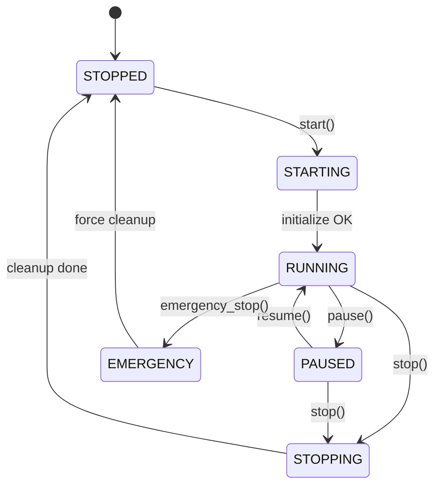

### Инициализация (`initialize()`, строки 207-378)

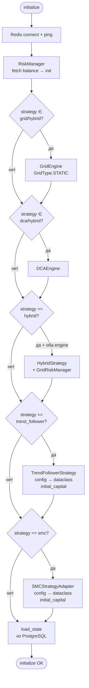

### Запуск (`start()`, строки 380-493)

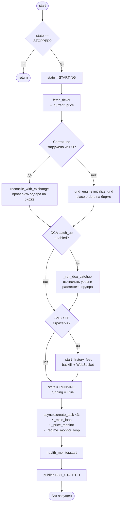

---

## 3. Главный цикл

Каждые **1 секунду** (`asyncio.sleep(1)`):

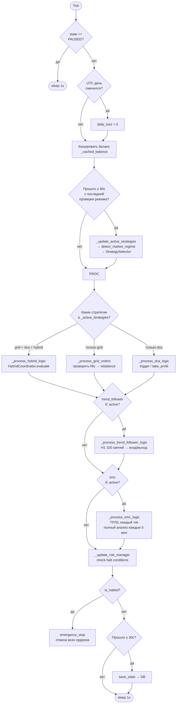

### Паттерн размещения ордеров (все стратегии)

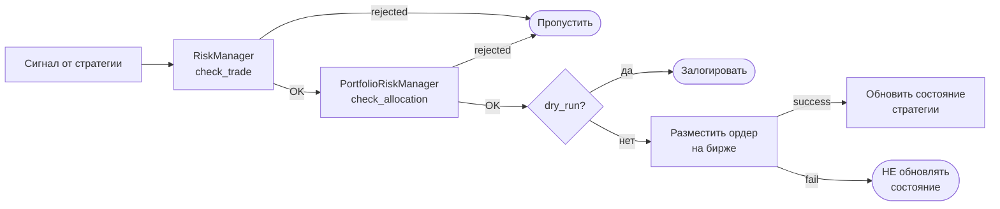

> **Принцип #231:** Ордер размещается на бирже **ДО** обновления состояния стратегии.
> Если ордер не прошёл — состояние не меняется (нет двойного учёта).

---

## 4. Определение режима рынка

Запускается каждые **60 секунд** (`regime_check_interval`).

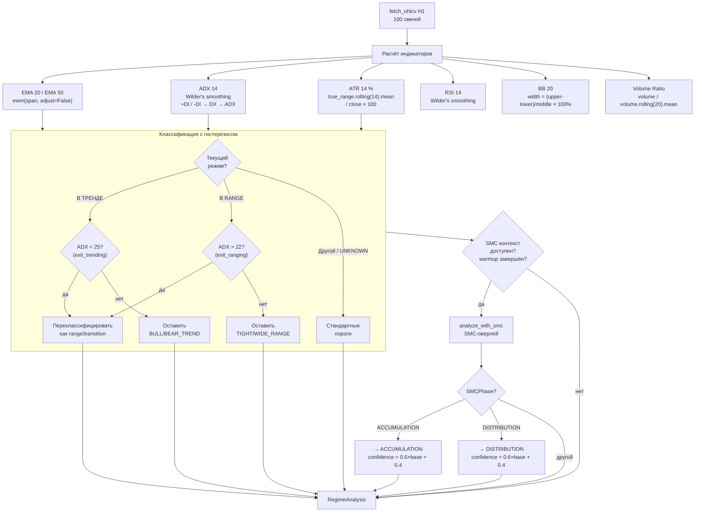

### ADX-гистерезис (предотвращение осцилляции)

```
              ┌─────── exit_trending = 25 ────────┐
              │                                     │
   RANGING ───┤      TRANSITION ZONE (18-32)       ├─── TRENDING
              │                                     │
              └─────── exit_ranging = 22 ──────────┘

   Вход в ТРЕНД: ADX поднимается выше 32
   Выход из ТРЕНДА: ADX падает ниже 25 (не 32!)
   Вход в RANGE: ADX падает ниже 18
   Выход из RANGE: ADX поднимается выше 22 (не 18!)
```

### Таблица режимов (8 штук)

| Режим | ADX | ATR | EMA | Источник |
|-------|-----|-----|-----|----------|
| `TIGHT_RANGE` | < 18 | < 1% | любой | Индикаторы |
| `WIDE_RANGE` | < 18 | ≥ 1% | любой | Индикаторы |
| `QUIET_TRANSITION` | 22–32 | < 2% | любой | Индикаторы |
| `VOLATILE_TRANSITION` | 22–32 | ≥ 2% | любой | Индикаторы |
| `BULL_TREND` | > 32 | — | EMA20 > EMA50 | Индикаторы |
| `BEAR_TREND` | > 32 | — | EMA20 < EMA50 | Индикаторы |
| `ACCUMULATION` | любой | — | — | **SMC CHoCH ↑** |
| `DISTRIBUTION` | любой | — | — | **SMC CHoCH ↓** |

### Confluence Score (0.0–1.0)

| Компонент | Вес | Формула |
|-----------|-----|---------|
| ADX | 30% | `(ADX - 20) / 20`, clamp 0–1 |
| Тренд | 25% | `|trend_strength|` |
| RSI | 20% | Bull: `(RSI - 50) / 50`; Bear: `(50 - RSI) / 50` |
| Volume | 15% | > 1.5 → 1.0; 1.0–1.5 → linear; < 0.8 → `ratio / 0.8` |
| BB Width | 10% | 2–4% → 1.0; outside → falloff |

### Параметры детектора

| Параметр | Значение | Гистерезис |
|----------|----------|------------|
| `ema_fast` / `ema_slow` | 20 / 50 | — |
| `adx_period` | 14 | enter_trending=32, exit=25 |
| `atr_period` | 14 | enter_ranging=18, exit=22 |
| `rsi_period` | 14 | — |
| `bb_period` | 20 | — |
| `atr_wide_threshold` | 1.0% | tight/wide boundary |
| `atr_volatile_threshold` | 2.0% | quiet/volatile boundary |
| `confluence_threshold` | 0.7 | для HYBRID-рекомендации |
| Минимум данных | 64 свечи H1 | `max(ema_slow + atr_period, ...)` |

---

## 5. SMC-ядро (core/smc)

Модуль `bot/core/smc/` — единственный источник правды для SMC-анализа. Используется и `MarketRegimeDetector` (оверлей), и `SMCStrategyAdapter` (торговля).

### Общая архитектура

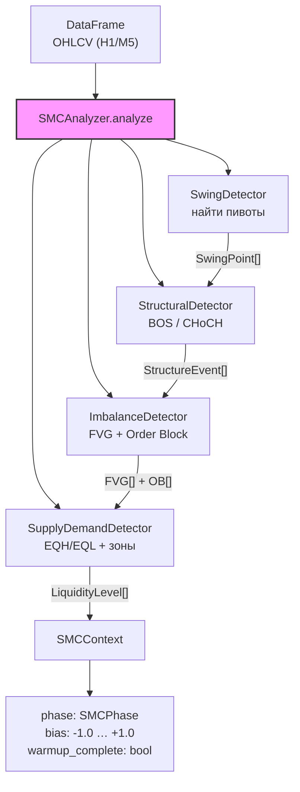

### 5.1 Swing Detector

**Алгоритм** (vectorised, O(n)):

```
Swing HIGH в позиции i ⟺ high[i] == max(high[i-strength : i+strength+1])
Swing LOW  в позиции i ⟺ low[i]  == min(low[i-strength : i+strength+1])
```

- `strength = 5` (по умолчанию) — количество баров в каждую сторону
- Бары в пределах `strength` от краёв DataFrame **не подтверждаются**
- Минимум данных: `2 × strength + 1 = 11` баров
- Реализация: `numpy.sliding_window_view` → rolling max/min

### 5.2 Structural Detector (BOS/CHoCH)

State-машина с тремя состояниями: `UNKNOWN → BULL / BEAR`

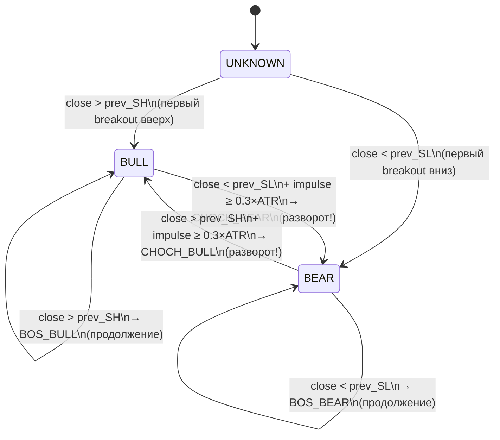

**Фильтр шума**: `impulse < min_impulse_atr × ATR` → пропустить (не считать за breakout)

| Событие | Тренд ДО | Тренд ПОСЛЕ | Значение |
|---------|----------|-------------|----------|
| `BOS_BULL` | BULL | BULL | Продолжение бычьего тренда |
| `BOS_BEAR` | BEAR | BEAR | Продолжение медвежьего тренда |
| `CHOCH_BULL` | BEAR | BULL | Разворот вверх (накопление) |
| `CHOCH_BEAR` | BULL | BEAR | Разворот вниз (распределение) |

### 5.3 Order Block Detection

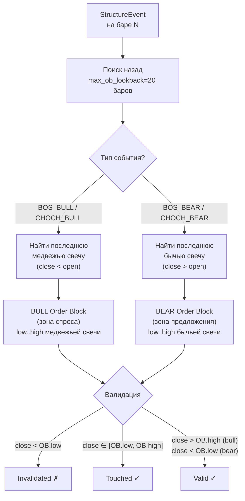

### 5.4 Fair Value Gap (FVG)

```
BULL FVG: high[i-2] < low[i]     → зона: [high[i-2], low[i]]
BEAR FVG: low[i-2]  > high[i]    → зона: [high[i], low[i-2]]
Фильтр: gap_size ≥ min_fvg_atr × ATR (default 0.2)
Filled: close ∈ [gap_low, gap_high]
```

### 5.5 Supply/Demand Levels

**EQH/EQL кластеризация:**
1. Сортировка swing points по цене
2. Группировка точек в пределах `tolerance_pct = 0.2%`
3. Группы с `touch_count ≥ 2` → `LiquidityLevel`
4. Strength: `min(1.0, touch_count / 5.0)`
5. Swept: EQH — `close > avg × 1.001`; EQL — `close < avg × 0.999`

**Supply/Demand из OB:**
- BULL OB → DEMAND level (strength = 0.7)
- BEAR OB → SUPPLY level (strength = 0.7)

### 5.6 Phase Derivation

```python
recent_events = last 10 structure_events
bull_count = count(is_bullish)
bear_count = len(recent) - bull_count
raw_bias = (bull_count - bear_count) / len(recent)
trend_bias = clip(raw_bias, -1.0, +1.0)

last_event = events[-1]
if last_event == BOS_BULL  → BULL_TREND
if last_event == BOS_BEAR  → BEAR_TREND
if last_event == CHOCH_BULL → ACCUMULATION
if last_event == CHOCH_BEAR → DISTRIBUTION
if no events              → RANGING
```

### Параметры SMC-ядра

| Параметр | Значение | Описание |
|----------|----------|----------|
| `swing_strength` | 5 | Баров в каждую сторону для подтверждения пивота |
| `min_warmup_bars` | 200 | Баров до `warmup_complete = True` |
| `min_impulse_atr` | 0.3 | Минимальный импульс (×ATR) для BOS/CHoCH |
| `min_fvg_atr` | 0.2 | Минимальный размер FVG (×ATR) |
| `tolerance_pct` | 0.002 | Кластеризация EQH/EQL (0.2%) |
| `min_eq_touches` | 2 | Минимум касаний для уровня ликвидности |
| `max_ob_lookback` | 20 | Баров назад для поиска свечи OB |
| `max_ob_count` | 10 | Хранить max 10 последних OB |
| `max_fvg_count` | 10 | Хранить max 10 последних FVG |

---

## 6. Маршрутизация стратегий

### `_update_active_strategies()` — полный flow

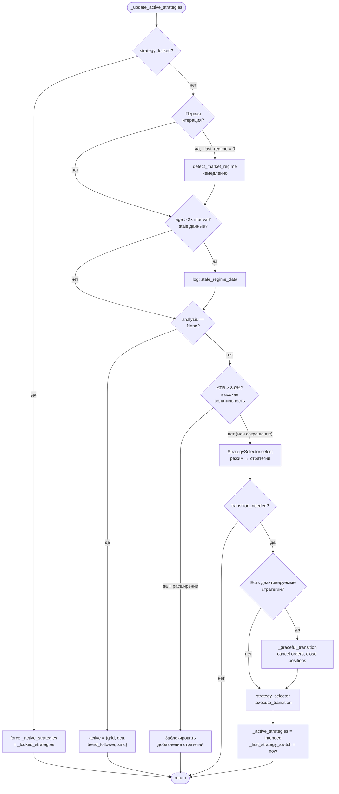

### StrategySelector — transition gates

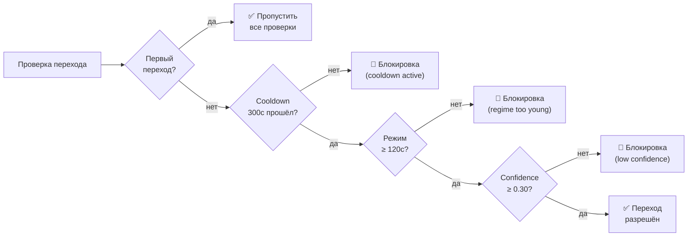

### Маппинг режим → стратегии

| Режим | Стратегии | Веса | Приоритет |
|-------|-----------|------|-----------|
| `TIGHT_RANGE` | Grid | 1.0 | 1 |
| `WIDE_RANGE` | Grid | 1.0 | 1 |
| `QUIET_TRANSITION` | Grid | 0.7 | 1 |
| `VOLATILE_TRANSITION` | SMC | 1.0 | 1 |
| `BULL_TREND` | TF + DCA | 0.7 + 0.3 | 1, 2 |
| `BULL_TREND` + confluence ≥ 0.7 | DCA + Grid + TF | 0.5 + 0.3 + 0.2 | 1, 2, 3 |
| `BEAR_TREND` | DCA | 1.0 | 1 |
| `ACCUMULATION` | SMC | 1.0 | 1 |
| `DISTRIBUTION` | SMC | 1.0 | 1 |
| `REDUCE_EXPOSURE` | — | — | — |

### Параметры маршрутизации

| Параметр | Значение | Описание |
|----------|----------|----------|
| `strategy_switch_cooldown_seconds` | 300 с | Минимум между переключениями |
| `regime_check_interval_seconds` | 60 с | Частота проверки режима |
| `_MIN_REGIME_CONFIDENCE` | 0.30 | Мин. уверенность для переключения |
| `_MIN_REGIME_DURATION_SECONDS` | 120 с | Мин. возраст режима |
| `_MAX_VOLATILITY_ATR_PCT` | 3.0% | Блок расширения при волатильности |

---

## 7. Grid-стратегия

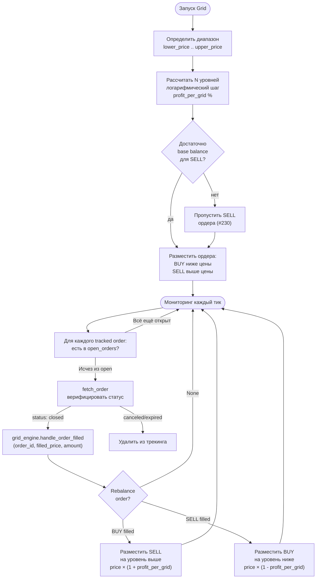

### Position Sizing

```
amount_per_grid = $150 (quote currency)
amount_base = amount_per_grid / level_price
quantized = round_down(amount_base, precision)
```

### Параметры Grid (BTC demo)

| Параметр | Значение | Описание |
|----------|----------|----------|
| `grid_levels` | 6 | Количество уровней сетки |
| `amount_per_grid` | $150 | Объём на каждый уровень |
| `profit_per_grid` | 1.2% | Шаг между уровнями |
| `stop_loss_percentage` | 12% | SL от нижней границы |
| `min_order_size` | $150 | Минимальный размер ордера |
| `capital_allocation` | 60% | Доля капитала (Hybrid-режим) |

---

## 8. DCA-стратегия

### Основной цикл

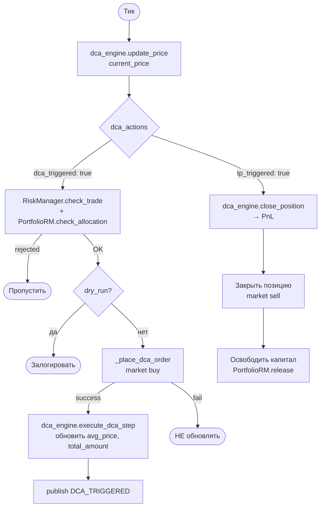

### Safety Orders (усреднение)

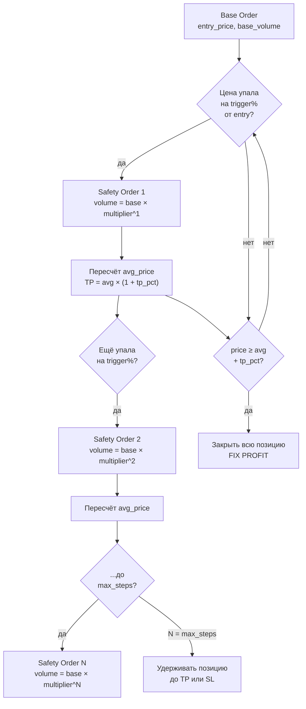

### DCA Catch-up (при перезапуске бота)

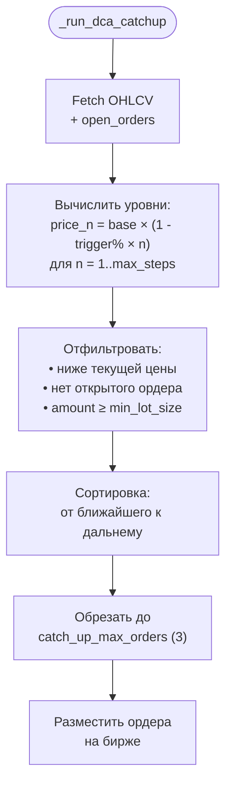

### Параметры DCA

| Параметр | BTC demo | SOL demo | Описание |
|----------|----------|----------|----------|
| `trigger_percentage` | 4% | 2% | Падение для входа/SO |
| `max_steps` | 4 | 4 | Максимум safety orders |
| `take_profit_percentage` | 8% | 8% | TP от средней цены |
| `step_multiplier` | 1.0 | 1.0 | Множитель объёма SO |
| `capital_allocation` | 30% | 100% | Доля капитала |
| `catch_up_enabled` | false | true | Умный старт |
| `max_daily_loss` | $600 | $600 | Дневной лимит |
| `catch_up_max_orders` | 3 | 3 | Макс. catch-up ордеров |

### Signal Generator (v2.0) — Confluence Score

| Компонент | Вес | Условие |
|-----------|-----|---------|
| Тренд | 3 | EMA fast < slow + ADX ≥ 20 |
| Цена | 2 | Расстояние до support ≤ 2% |
| Индикаторы | 2 | RSI < 35 + Volume ≥ 1.2× + Price ≤ BB lower |
| Риск | 1 | Active deals < max + Daily PnL > -$500 |
| Тайминг | 1 | Cooldown ≥ 1 час |
| **Порог** | | **≥ 0.75 (75%)** |

---

## 9. TrendFollower-стратегия

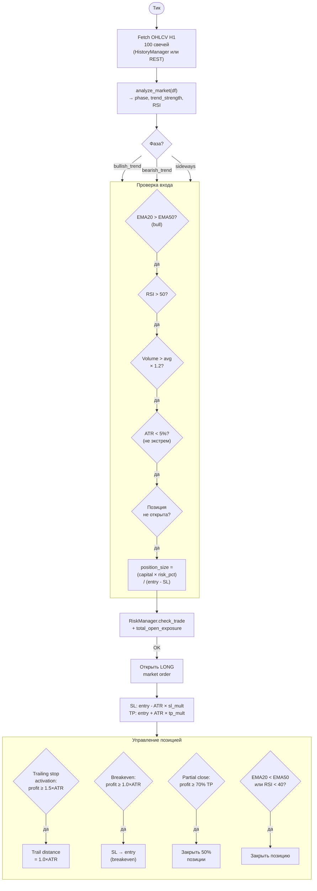

### SL/TP множители (зависят от фазы)

| Фаза | SL множитель ATR | TP множитель ATR | R:R |
|------|------------------|------------------|-----|
| Sideways | 1.0 | 1.0 | 1:1 |
| Weak trend | 2.0 | 1.5 | 1:0.75 |
| Strong trend | 2.5 | 2.5 | 1:1 |

### Risk Manager (TF-специфичный)

| Параметр | Значение | Описание |
|----------|----------|----------|
| `risk_per_trade_pct` | 2% | Риск на сделку от капитала |
| `max_position_size_usd` | 10% капитала | Абсолютный лимит позиции |
| `max_concurrent_positions` | 3 | Макс. одновременных позиций |
| `max_consecutive_losses` | 3 | → снижение размера на 50% |
| `daily_loss_limit` | $500 | Дневной лимит |
| `min_balance_buffer` | 5% | Минимальный остаток |

### Параметры TrendFollower (BTC demo)

| Параметр | Значение | Описание |
|----------|----------|----------|
| `ema_fast_period` | 20 | Период быстрой EMA |
| `ema_slow_period` | 50 | Период медленной EMA |
| `atr_period` | 14 | Период ATR для SL/TP |
| `rsi_period` | 14 | Период RSI |
| `risk_per_trade_pct` | 1% | Риск на сделку от баланса |
| `max_positions` | 2 | Макс. одновременных позиций |
| `trailing_stop_atr_mult` | 2.0× | Множитель ATR для трейлинг-стопа |
| `take_profit_atr_mult` | 3.0× | Множитель ATR для тейк-профита |
| `active_regimes` | bull_trend | Только в бычьем тренде |

---

## 10. SMC-стратегия

### Многотаймфреймный анализ

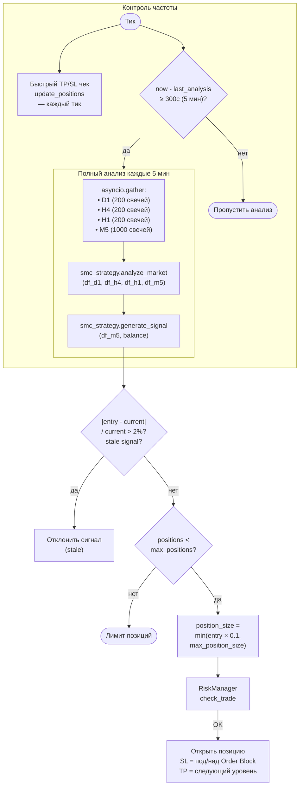

### Поиск входа (M5 precision)

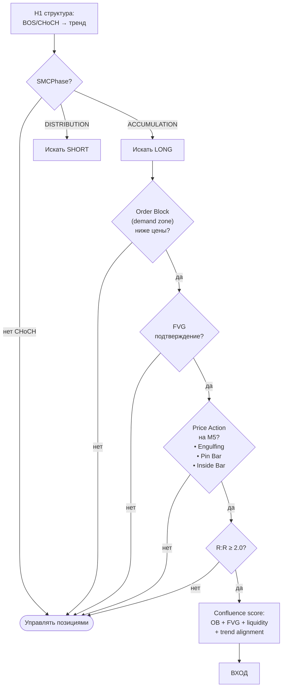

### Price Action паттерны (M5)

| Паттерн | Условие | SL | TP |
|---------|---------|----|----|
| **Engulfing (bull)** | Body[i] полностью перекрывает body[i-1], close > prev.open | Под low[i-1] + 0.5% | Ближайший OB/FVG/уровень выше |
| **Engulfing (bear)** | Инвертированный | Над high[i-1] + 0.5% | Ближайший OB/FVG/уровень ниже |
| **Pin Bar (hammer)** | Тень > 60% свечи, close у верхней трети | Под low тени | Ближайший resistance |
| **Pin Bar (shooting star)** | Инвертированный | Над high тени | Ближайший support |
| **Inside Bar** | Range ⊂ range[i-1] | Под low[i-1] / над high[i-1] | Ближайший уровень |

### Параметры SMC (BTC demo)

| Параметр | Значение | Описание |
|----------|----------|----------|
| `swing_length` | 10 | Длина свинга для структуры H1 |
| `min_risk_reward` | 2.0 | Минимальный R:R для входа |
| `max_positions` | 2 | Макс. одновременных позиций |
| `risk_per_trade_pct` | 1% | Риск на сделку |
| `require_volume_confirmation` | false | Подтверждение объёмом |
| `active_regimes` | accumulation, distribution | Режимы для входа |
| `_smc_analysis_interval` | 300с (5 мин) | Частота полного анализа |
| Stale threshold | 2% | `|entry - current| / current` |

---

## 11. Hybrid-режим (Grid↔DCA)

### Координатор решений

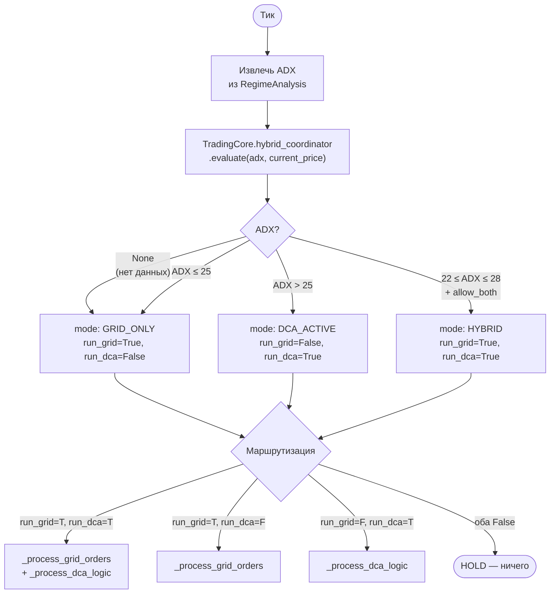

### Параметры Hybrid

| Параметр | Значение | Описание |
|----------|----------|----------|
| `adx_dca_threshold` | 25.0 | ADX порог переключения Grid→DCA |
| `adx_tolerance` | 3.0 | Зона гистерезиса вокруг порога |
| `allow_both` | false | Одновременная работа |
| `grid_capital_pct` | 60% | Доля капитала для Grid |
| `dca_capital_pct` | 30% | Доля капитала для DCA |
| `initial_mode` | GRID_ONLY | Стартовый режим |

---

## 12. Risk Management (3 уровня)

```mermaid
flowchart TD
    subgraph L1 [Уровень 1: Per-Strategy]
        GRID_SL["Grid: SL = 12%\nот нижней границы"]
        DCA_MAX["DCA: max_daily_loss\n= $600"]
        TF_RISK["TF: risk_per_trade\n= 1-2%, trailing stop"]
        SMC_SL["SMC: SL под Order Block\nR:R ≥ 2.0"]
    end

    subgraph L2 [Уровень 2: Per-Bot RiskManager]
        RM_CHK["Каждый тик:"]
        RM_CHK --> POS{"position_size >\nmax_position_size?"}
        POS --> |да| BLOCK_ENTRY["Заблокировать\nновые входы"]
        POS --> |нет| DAILY{"daily_loss >\nmax_daily_loss?"}
        DAILY --> |да| HALT["HALT: остановить\nвсе стратегии"]
        DAILY --> |нет| DD{"drawdown >\nstop_loss_pct?"}
        DD --> |да| HALT
        DD --> |нет| OK[Торговля разрешена]
    end

    subgraph L3 [Уровень 3: Portfolio optional]
        PRM["PortfolioRiskManager"]
        PRM --> UTIL{"total_allocated >\ncapital × 80%?"}
        UTIL --> |да| REJECT_EXP["REJECTED_EXPOSURE"]
        UTIL --> |нет| PAIR{"pair_exposure >\ncapital × 25%?"}
        PAIR --> |да| REJECT_PAIR["REJECTED_PAIR_LIMIT"]
        PAIR --> |нет| CORR{"Коррелированная\nпара активна?\nBTC/ETH = 0.85"}
        CORR --> |да| REJECT_CORR["REJECTED_CORRELATION"]
        CORR --> |нет| PORT_DD{"portfolio drawdown\n> 15%?"}
        PORT_DD --> |да| PORT_HALT["PORTFOLIO HALTED\nвсе боты"]
        PORT_DD --> |нет| APPROVED["APPROVED ✓"]
    end

    L1 --> L2
    L2 --> L3
```

### Каскад проверки при каждом ордере

```
1. Strategy-level check (Grid SL / DCA max_steps / TF risk_per_trade / SMC R:R)
2. RiskManager.check_trade(order_value, current_position, available_balance)
   ├── check_order_size: value ≥ min_order_size
   ├── check_position_limit: current + additional ≤ max_position_size
   └── check_available_balance: available ≥ required
3. PortfolioRiskManager.check_allocation(bot_name, amount, balance, symbol)
   ├── portfolio halt check
   ├── per-pair cap (25%)
   ├── total exposure cap (80%)
   └── correlation check (BTC/ETH = 0.85)
```

### Параметры риска

| Параметр | Уровень | Значение | Описание |
|----------|---------|----------|----------|
| `max_position_size` | Per-bot | $3,000 | Макс. размер позиции |
| `min_order_size` | Per-bot | $10-150 | Минимальный ордер |
| `max_daily_loss` | Per-bot | $600 | Дневной лимит убытка |
| `max_daily_loss_pct` | Per-bot | 6% | Дневной лимит в % |
| `stop_loss_percentage` | Per-bot | configurable | Портфельный SL |
| `risk_per_trade_pct` | Per-bot | 1-2% | Риск на одну сделку |
| `max_total_exposure_pct` | Portfolio | 80% | Утилизация капитала |
| `max_single_pair_pct` | Portfolio | 25% | Лимит на одну пару |
| `max_correlation_limit` | Portfolio | 0.80 | Блок коррелированных пар |
| `portfolio_stop_loss_pct` | Portfolio | 15% | Drawdown → halt всех ботов |
| `daily_reset` | Per-bot | UTC 00:00 | Сброс daily_loss |

---

## 13. Graceful Transition

Срабатывает когда `StrategySelector` решает **деактивировать** стратегию.

```mermaid
flowchart TD
    DEACT["Стратегии для\nдеактивации:\nset of str"] --> EVENT1["publish\nSTRATEGY_TRANSITION_STARTED"]
    EVENT1 --> CLOSE_CFG{close_positions\n_on_switch\n= true?}

    CLOSE_CFG --> |нет| GRID_ONLY_D
    CLOSE_CFG --> |да| FULL

    subgraph FULL [Полное закрытие]
        direction TB
        GRID_D{"grid ∈\ndeactivated?"} --> |да| CANCEL["exchange.cancel_all_orders\n(symbol)"]
        GRID_D --> |нет| DCA_D

        CANCEL --> DCA_D{"dca ∈\ndeactivated?"}
        DCA_D --> |да| CLOSE_DCA["_close_dca_position\nmarket sell"]
        DCA_D --> |нет| TF_D

        CLOSE_DCA --> TF_D{"trend_follower ∈\ndeactivated?"}
        TF_D --> |да| CLOSE_TF["Для каждой позиции:\nmarket order\nopposite side\nreduceOnly=True"]
        TF_D --> |нет| SMC_D

        CLOSE_TF --> SMC_D{"smc ∈\ndeactivated?"}
        SMC_D --> |да| CLOSE_SMC["Для каждой позиции:\nmarket order\nopposite side\nreduceOnly=True"]
        SMC_D --> |нет| DONE_FULL
        CLOSE_SMC --> DONE_FULL([Закрытие завершено])
    end

    subgraph GRID_ONLY_D [Только отмена Grid]
        CANCEL_ONLY["cancel_all_orders\n(только Grid лимитки)"]
    end

    DONE_FULL --> EVENT2
    CANCEL_ONLY --> EVENT2
    EVENT2["publish\nSTRATEGY_TRANSITION_COMPLETED"]
    EVENT2 --> DONE([Transition завершён])
```

### Параметры перехода

| Параметр | Значение | Описание |
|----------|----------|----------|
| `close_positions_on_switch` | false | Закрывать позиции при деактивации |
| `strategy_switch_cooldown_seconds` | 300 с | Cooldown между переключениями |

---

## 14. Health Monitor и автовосстановление

### Цикл мониторинга (каждые 30 секунд)

```mermaid
flowchart TD
    CHECK([check_all]) --> ITER["Для каждой стратегии\nв StrategyRegistry"]

    ITER --> STATE{state?}
    STATE --> |ERROR| CRITICAL_1["🔴 CRITICAL\n+ error message"]
    STATE --> |"не ACTIVE/PAUSED"| HEALTHY_1["🟢 HEALTHY\n(не мониторится)"]
    STATE --> |"ACTIVE/PAUSED"| CHECKS

    subgraph CHECKS [Проверки]
        ERR_CNT{"error_count\n≥ 10?"} --> |да| UNHEALTHY["🟡 UNHEALTHY"]
        ERR_CNT --> |нет| CONSEC{"consecutive\nerrors ≥ 3?"}
        CONSEC --> |да| CRITICAL_2["🔴 CRITICAL\n(override)"]
        CONSEC --> |нет| SIG_TO{"Нет сигнала\n> 300с?"}
        SIG_TO --> |да| DEGRADED["🟠 DEGRADED"]
        SIG_TO --> |нет| TRADE_TO{"Нет сделок\n> 3600с?"}
        TRADE_TO --> |да| DEGRADED
        TRADE_TO --> |нет| HEALTHY_2["🟢 HEALTHY"]
    end

    CRITICAL_1 --> CALLBACKS
    CRITICAL_2 --> CALLBACKS
    UNHEALTHY --> CALLBACKS
    DEGRADED --> CALLBACKS

    subgraph CALLBACKS [Реакция]
        CB_UNH["on_unhealthy callback"]
        CB_CRIT["on_critical callback"]
        AUTO{"auto_restart\n= true\n+ state = ERROR?"}
        AUTO --> |да| RESTART{"restart_attempts\n< max (3)?"}
        RESTART --> |да| DO_RESTART["reset_strategy\n→ start_strategy"]
        RESTART --> |нет| GIVE_UP["Макс. перезапусков\nдостигнут"]
    end
```

### Overall Status

| Статус | Условие |
|--------|---------|
| 🔴 CRITICAL | Хотя бы одна стратегия CRITICAL |
| 🟡 UNHEALTHY | Хотя бы одна UNHEALTHY (нет CRITICAL) |
| 🟠 DEGRADED | Хотя бы одна DEGRADED |
| 🟢 HEALTHY | Все стратегии OK |

### Пороги

| Порог | Значение | Описание |
|-------|----------|----------|
| `max_error_count` | 10 | Ошибок до UNHEALTHY |
| `max_consecutive_errors` | 3 | Подряд до CRITICAL |
| `signal_timeout_seconds` | 300 | Нет сигнала → DEGRADED |
| `trade_timeout_seconds` | 3600 | Нет сделки → DEGRADED |
| `auto_restart` | true | Авторестарт при ERROR |
| `max_restart_attempts` | 3 | Макс. перезапусков |
| `check_interval` | 30 с | Интервал проверок |

---

## 15. Система событий

### State Machine стратегии (StrategyRegistry)

```mermaid
stateDiagram-v2
    [*] --> IDLE
    IDLE --> STARTING: register + start

    STARTING --> ACTIVE: init success
    STARTING --> ERROR: init fail

    ACTIVE --> PAUSED: pause()
    PAUSED --> ACTIVE: resume()

    ACTIVE --> STOPPING: stop()
    PAUSED --> STOPPING: stop()

    STOPPING --> STOPPED: cleanup done
    STOPPED --> IDLE: reset()

    ACTIVE --> ERROR: runtime error
    PAUSED --> ERROR: runtime error
    STOPPING --> ERROR: cleanup error

    ERROR --> IDLE: reset()
    ERROR --> STOPPING: force stop
```

### Типы событий (35+)

| Категория | События |
|-----------|---------|
| **Жизненный цикл бота** | BOT_STARTED, BOT_STOPPED, BOT_PAUSED, BOT_RESUMED, BOT_EMERGENCY_STOP |
| **Ордера** | ORDER_PLACED, ORDER_FILLED, ORDER_CANCELLED, ORDER_FAILED |
| **Grid/DCA** | GRID_INITIALIZED, GRID_REBALANCED, DCA_TRIGGERED, TAKE_PROFIT_HIT, GRID_BREAKOUT |
| **Стратегии** | STRATEGY_REGISTERED, STRATEGY_STARTED, STRATEGY_STOPPED, STRATEGY_PAUSED, STRATEGY_RESUMED, STRATEGY_ERROR, STRATEGY_RESTARTED |
| **Режим рынка** | REGIME_DETECTED, REGIME_CHANGED, STRATEGY_SWITCH_RECOMMENDED |
| **Здоровье** | HEALTH_CHECK_COMPLETED, HEALTH_DEGRADED, HEALTH_CRITICAL |
| **Переходы** | STRATEGY_TRANSITION_STARTED, STRATEGY_TRANSITION_COMPLETED |
| **Блокировки** | STRATEGY_LOCKED, STRATEGY_UNLOCKED |
| **Риск** | RISK_LIMIT_HIT, STOP_LOSS_TRIGGERED, POSITION_LIMIT_REACHED |
| **Hybrid** | HYBRID_MODE_ACTIVATED, HYBRID_TRANSITION |
| **Прочие** | PRICE_UPDATED, ERROR_OCCURRED, EXCHANGE_ERROR |

### TradingEvent структура

```python
@dataclass
class TradingEvent:
    event_type: EventType
    bot_name: str
    timestamp: str  # ISO8601
    data: dict[str, Any]  # Decimal → str при сериализации
```

---

## 16. Exchange Client (Bybit V5)

### Архитектура запросов

```mermaid
flowchart LR
    CLIENT[ByBitDirectClient] --> AUTH["HMAC-SHA256 подпись\ntimestamp + api_key\n+ recv_window + params"]
    AUTH --> RETRY["tenacity retry\n3 попытки\nexp backoff 1-10с"]
    RETRY --> |"NetworkError\nRateLimitError"| RETRY
    RETRY --> |"AuthError\nInvalidOrder\nInsufficient"| FAIL[Ошибка]
    RETRY --> |success| PARSE["Парсинг ответа\nnormalize статусов"]
```

### Нормализация статусов ордеров

| Bybit Status | Наш статус |
|-------------|------------|
| `New` | open |
| `PartiallyFilled` | open |
| `Filled` | **closed** |
| `Cancelled` | cancelled |
| `Rejected` | rejected |
| `Deactivated` | cancelled |

### Ключевой фикс: LinearFutures precision (#9d53210)

```
Bybit /v5/market/instruments-info для SOL/USDT:
├── SOLUSDT (LinearPerpetual): qtyStep=0.1 → precision=1 → qty=0.2 ✅
├── SOLUSDT-06MAR26 (LinearFutures): qtyStep=0.01 → precision=2 → qty=0.24 ❌
├── SOLUSDT-13MAR26 ...
└── ...

Фикс: if contractType != "LinearPerpetual": continue
```

### Precision & Rounding

```python
# Из qtyStep (НЕ basePrecision!)
precision['amount'] = abs(Decimal(qtyStep).as_tuple().exponent)
precision['price']  = abs(Decimal(tickSize).as_tuple().exponent)

# Round DOWN для ордеров
quantizer = Decimal(10) ** -precision
rounded = Decimal(str(amount)).quantize(quantizer, rounding="ROUND_DOWN")
```

### Параметры клиента

| Параметр | Значение | Описание |
|----------|----------|----------|
| Base URL (demo) | `api-demo.bybit.com` | Demo Trading API |
| Base URL (live) | `api.bybit.com` | Production API |
| `recv_window` | 10000 мс | Допуск серверного времени |
| Retry | 3 попытки | С exponential backoff 1–10с |
| Category (demo) | `linear` | Demo Trading = только linear |
| `positionIdx` | 0 | One-way mode |
| `timeInForce` | GTC | Good Till Cancel |

---

## 17. Сводная таблица: режим → стратегия → поведение

| Режим рынка | ADX | ATR | Активные стратегии | Ожидаемое действие | Throttle |
|-------------|-----|-----|-------------------|-------------------|----------|
| TIGHT_RANGE | < 18 | < 1% | Grid | Сетка в узком диапазоне | — |
| WIDE_RANGE | < 18 | ≥ 1% | Grid | Сетка с широкими уровнями | — |
| QUIET_TRANSITION | 22–32 | < 2% | Grid (0.7) | Сетка, сниженная аллокация | — |
| VOLATILE_TRANSITION | 22–32 | ≥ 2% | SMC | Ловля разворотов от OB/FVG | 5 мин |
| BULL_TREND (low conf) | > 32 | — | TF (0.7) + DCA (0.3) | Тренд + усреднение | TF: каждый тик, DCA: каждый тик |
| BULL_TREND (high conf) | > 32 | — | DCA + Grid + TF | Гибридный режим (HybridCoordinator) | — |
| BEAR_TREND | > 32 | — | DCA | Усреднение при падении | — |
| ACCUMULATION | любой | — | SMC | CHoCH вверх → long от OB | 5 мин |
| DISTRIBUTION | любой | — | SMC | CHoCH вниз → short от OB | 5 мин |

### Таймлайн одного тика (worst case)

```
0ms     ─── Начало тика
1ms     ─── Проверка pause/daily reset
2ms     ─── Cache balance (может REST call ~100ms)
100ms   ─── _update_active_strategies (каждые 60с):
             ├── detect_market_regime (fetch 100 H1 candles ~200ms)
             ├── StrategySelector.select (< 1ms)
             └── graceful_transition (если нужно, cancel/close ~500ms)
600ms   ─── _process_hybrid_logic / grid / dca
700ms   ─── _process_trend_follower_logic (fetch 100 H1 candles ~200ms, если нет cache)
900ms   ─── _process_smc_logic:
             ├── Quick TP/SL check (< 1ms)
             └── Full analysis (каждые 5 мин): fetch 4 TF ~800ms + analyze ~50ms
1750ms  ─── _update_risk_manager (< 1ms)
1751ms  ─── save_state (каждые 30с, ~50ms)
1800ms  ─── sleep до следующей секунды
```

---

## Appendix A: Ключевые файлы

| Категория | Файл | Строк | Описание |
|-----------|------|-------|----------|
| **Orchestrator** | `bot/orchestrator/bot_orchestrator.py` | ~2365 | Главный координатор |
| | `bot/orchestrator/market_regime.py` | ~809 | 8-режимный классификатор |
| | `bot/orchestrator/strategy_selector.py` | ~483 | Маппинг режим → стратегии |
| | `bot/orchestrator/strategy_registry.py` | ~358 | State machine стратегий |
| | `bot/orchestrator/health_monitor.py` | ~331 | Мониторинг + авторестарт |
| | `bot/orchestrator/events.py` | ~163 | 35+ типов событий |
| **SMC Core** | `bot/core/smc/analyzer.py` | ~200 | Оркестратор SMC-анализа |
| | `bot/core/smc/models.py` | ~250 | SwingPoint, OB, FVG, SMCContext |
| | `bot/core/smc/swing_detector.py` | ~80 | Пивоты (numpy vectorised) |
| | `bot/core/smc/structural_detector.py` | ~120 | BOS/CHoCH state machine |
| | `bot/core/smc/imbalance_detector.py` | ~150 | FVG + Order Block |
| | `bot/core/smc/supply_demand_detector.py` | ~130 | EQH/EQL + Supply/Demand |
| **Strategies** | `bot/strategies/smc/smc_strategy.py` | ~400 | Multi-TF SMC торговля |
| | `bot/strategies/trend_follower/trend_follower_strategy.py` | ~500 | EMA/RSI тренд + trailing |
| | `bot/strategies/dca/dca_signal_generator.py` | ~300 | Confluence-based DCA |
| | `bot/strategies/hybrid/hybrid_strategy.py` | ~250 | Grid↔DCA координация |
| **Core** | `bot/core/grid_engine.py` | ~400 | Сеточный движок |
| | `bot/core/dca_engine.py` | ~300 | DCA движок |
| | `bot/core/risk_manager.py` | ~250 | Per-bot лимиты |
| | `bot/core/portfolio_risk_manager.py` | ~350 | Кросс-пар риск |
| | `bot/core/trading_core/config.py` | ~100 | Shared config live↔backtest |
| | `bot/core/trading_core/hybrid_coordinator.py` | ~120 | Stateless Grid/DCA routing |
| **Exchange** | `bot/api/bybit_direct_client.py` | ~1111 | Bybit V5 REST + HMAC |

---

*Связанные документы: [bot_architecture.md](bot_architecture.md) (v2.0.0) | [SESSION_CONTEXT.md](SESSION_CONTEXT.md) | [persona.md](persona.md)*
